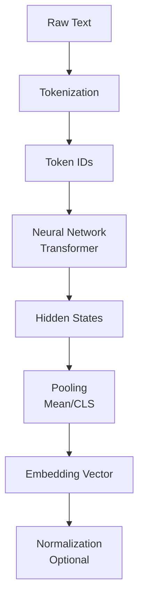
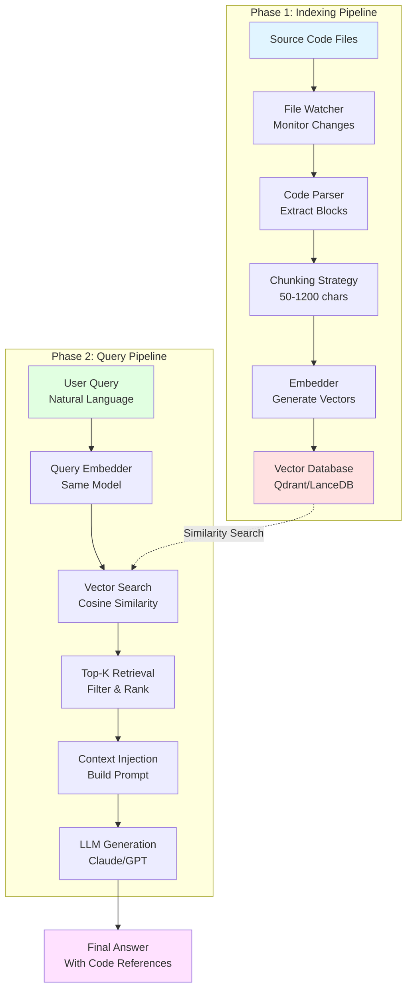
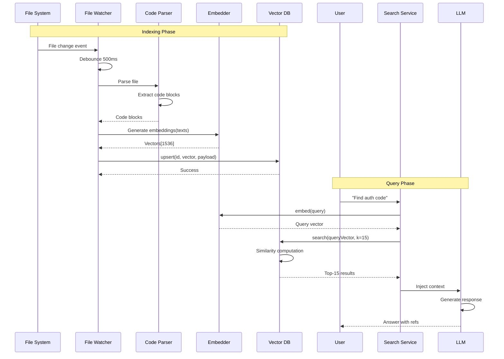
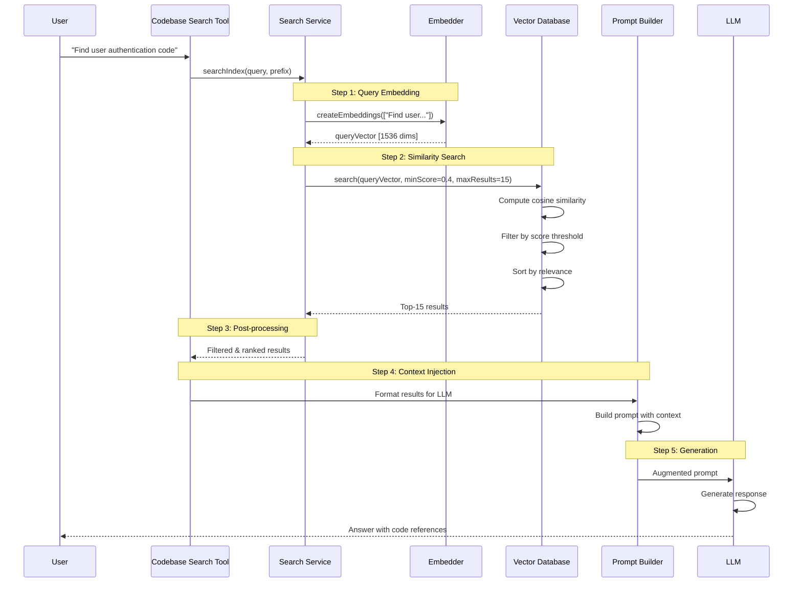
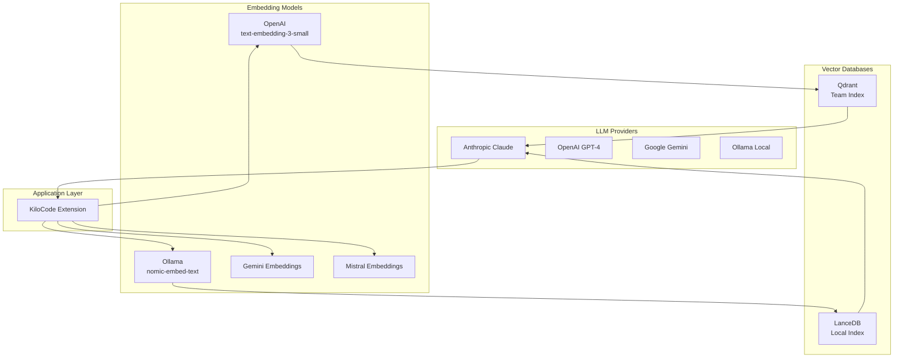

# Embeddings and Retrieval Augmented Generation (RAG) in KiloCode
## Complete Technical Documentation for Interview Preparation

---

## Table of Contents
1. [Introduction](#1-introduction)
2. [Embedding Fundamentals](#2-embedding-fundamentals)
3. [Vector Databases](#3-vector-databases)
4. [End-to-End RAG Architecture](#4-end-to-end-rag-architecture)
5. [Data Ingestion Pipeline](#5-data-ingestion-pipeline)
6. [Step-by-Step RAG Flow](#6-step-by-step-rag-flow)
7. [Similarity Search Deep Dive](#7-similarity-search-deep-dive)
8. [Tools & Tech Stack](#8-tools--tech-stack)
9. [System Design Diagrams](#9-system-design-diagrams)
10. [Real-World Use Cases](#10-real-world-use-cases)
11. [Common Interview Questions](#11-common-interview-questions)
12. [Performance Optimizations](#12-performance-optimizations)
13. [Security & Cost Considerations](#13-security--cost-considerations)
14. [RAG vs Fine-Tuning](#14-rag-vs-fine-tuning)
15. [Common Mistakes](#15-common-mistakes)

---

## 1. Introduction

### 1.1 What are Embeddings?

**Embeddings** are numerical representations (vectors) of text that capture semantic meaning in a multi-dimensional space.

**Simple Analogy**: Think of words as coordinates on a map. Words with similar meanings are placed closer together in this multi-dimensional space.

```
Example:
"user authentication" → [0.234, -0.567, 0.891, ..., 0.123]  (1536 dimensions)
"login system"        → [0.241, -0.571, 0.887, ..., 0.119]  (similar vector!)
"banana recipe"       → [-0.891, 0.234, -0.456, ..., 0.789] (very different!)
```

**Key Properties**:
- Vectors with similar semantic meaning are geometrically close
- Distance between vectors indicates semantic similarity
- Direction in vector space represents meaning
- Dimension size varies by model (384 to 3072+)

### 1.2 Why Embeddings are Needed

Traditional search relies on **keyword matching** which has major limitations:

| Keyword Search | Semantic Search (Embeddings) |
|----------------|------------------------------|
| ❌ Exact match only | ✅ Understands meaning |
| ❌ Misses synonyms | ✅ Finds related concepts |
| ❌ No context awareness | ✅ Context-aware |
| ❌ Language-specific | ✅ Cross-lingual capability |

**Example Problem**:
```
Query: "How to verify user identity?"
Keyword Search: Misses code with "authenticate", "login", "auth"
Semantic Search: Finds all related authentication code
```

**Benefits**:
1. **Semantic Understanding**: Captures meaning beyond exact words
2. **Context Awareness**: Similar contexts produce similar vectors
3. **Scalability**: Fast similarity computation using vector math
4. **Flexibility**: Works across languages and domains

### 1.3 What is Retrieval Augmented Generation (RAG)?

**RAG** enhances Large Language Models (LLMs) by retrieving relevant context from external knowledge bases before generating responses.

**The Problem RAG Solves**:
- ❌ LLMs have limited context windows (4K-200K tokens)
- ❌ Cannot access private/proprietary data
- ❌ Knowledge cutoff dates (training data is static)
- ❌ Hallucination without accurate information
- ❌ Fine-tuning is expensive and time-consuming

**The RAG Solution**:
```
User Query → Retrieve Relevant Context → Augment Prompt → LLM → Enhanced Answer
```

**RAG Pipeline Overview**:


---

## 2. Embedding Fundamentals

### 2.1 What is a Vector?

A **vector** is an ordered list of numbers representing a point in multi-dimensional space.

```typescript
// From KiloCode codebase
type Vector = number[]  // Example: [0.234, -0.567, 0.891, ..., 0.123]

// Real example from OpenAI text-embedding-3-small
const embedding: Vector = [
    0.0023064255,
    -0.009327292,
    -0.0028842222,
    // ... 1533 more dimensions
]
```

**Vector Properties**:
- **Dimension**: Number of elements (e.g., 1536)
- **Direction**: Indicates semantic meaning
- **Magnitude**: Can be normalized to unit length
- **Distance**: Similarity measured geometrically

**Visualization** (simplified to 2D):
```
        user login (0.8, 0.6)
              /
             /
            /
    authentication (0.7, 0.5)
    
    
    
                             banana recipe (0.2, -0.9)
```

### 2.2 Vector Dimensionality

Different embedding models produce vectors of different sizes:

```typescript
// From KiloCode: src/services/code-index/service-factory.ts
const vectorSize = getModelDimension(provider, modelId)

// If not found, fallback to config or default
if (!vectorSize && config.modelDimension && config.modelDimension > 0) {
    vectorSize = config.modelDimension
}

// Default to 512 if no dimension is determined
if (vectorSize === undefined || vectorSize <= 0) {
    vectorSize = 512
}
```

**Common Embedding Dimensions**:

| Model | Dimensions | Use Case | Performance |
|-------|-----------|----------|-------------|
| OpenAI text-embedding-3-small | 1536 | General purpose, balanced | Fast |
| OpenAI text-embedding-3-large | 3072 | High accuracy needs | Slower |
| OpenAI ada-002 | 1536 | Legacy | Fast |
| Ollama nomic-embed-text | 768 | Local/private | Very fast |
| BERT base | 768 | Research, NLP | Fast |
| Sentence-BERT | 384 | Lightweight | Very fast |

**Trade-offs**:
```
Higher Dimensions:
✅ More semantic information captured
✅ Better accuracy and nuance
❌ Slower computation
❌ More storage required
❌ Higher memory usage

Lower Dimensions:
✅ Faster search and processing
✅ Less storage needed
✅ Lower memory footprint
❌ May lose semantic nuance
❌ Lower accuracy
```

### 2.3 How Text is Converted into Embeddings

**Step-by-Step Process**:



**Detailed Implementation in KiloCode**:

```typescript
// From: src/services/code-index/embedders/openai.ts
export class OpenAiEmbedder implements IEmbedder {
    async createEmbeddings(texts: string[], model?: string): Promise<EmbeddingResponse> {
        const modelToUse = model || this.defaultModelId
        
        // Step 1: Apply model-specific query prefix if required
        const queryPrefix = getModelQueryPrefix("openai", modelToUse)
        const processedTexts = queryPrefix 
            ? texts.map((text, index) => {
                  // Prevent double-prefixing
                  if (text.startsWith(queryPrefix)) {
                      return text
                  }
                  const prefixedText = `${queryPrefix}${text}`
                  
                  // Check token limit
                  const estimatedTokens = Math.ceil(prefixedText.length / 4)
                  if (estimatedTokens > MAX_ITEM_TOKENS) {
                      console.warn(`Text ${index} exceeds token limit`)
                      return text  // Return original
                  }
                  return prefixedText
              })
            : texts
        
        // Step 2: Batch processing with rate limiting
        const allEmbeddings: number[][] = []
        const batchSize = 100  // OpenAI batch limit
        
        for (let i = 0; i < processedTexts.length; i += batchSize) {
            const batch = processedTexts.slice(i, i + batchSize)
            
            // Step 3: Call OpenAI API
            const response = await this.embeddingsClient.embeddings.create({
                input: batch,
                model: modelToUse,
                encoding_format: "base64"  // For larger dimensions (>256)
            })
            
            // Step 4: Convert base64 to float32 arrays
            const batchEmbeddings = response.data.map((item) => {
                if (typeof item.embedding === "string") {
                    const buffer = Buffer.from(item.embedding, "base64")
                    
                    // Create Float32Array view over the buffer
                    const float32Array = new Float32Array(
                        buffer.buffer, 
                        buffer.byteOffset, 
                        buffer.byteLength / 4
                    )
                    
                    return Array.from(float32Array)
                }
                return item.embedding
            })
            
            allEmbeddings.push(...batchEmbeddings)
        }
        
        return {
            embeddings: allEmbeddings,
            usage: {
                promptTokens: response.usage?.prompt_tokens || 0,
                totalTokens: response.usage?.total_tokens || 0
            }
        }
    }
}
```

**What Happens Inside the Neural Network**:

1. **Tokenization**: Text → Token IDs
   ```
   "user authentication" → [1234, 5678]
   ```

2. **Embedding Layer**: Token IDs → Initial embeddings
   ```
   [1234, 5678] → [[0.1, 0.2, ...], [0.3, 0.4, ...]]
   ```

3. **Transformer Layers**: Process context and relationships
   ```
   Multiple attention layers capture semantic meaning
   ```

4. **Pooling**: Combine token embeddings → Single vector
   ```
   Mean pooling or CLS token → [0.234, -0.567, ...]
   ```

5. **Normalization**: Scale to unit length (optional)
   ```
   Vector length = 1.0 for cosine similarity
   ```

### 2.4 Popular Embedding Models

**KiloCode supports multiple embedding providers**:

```typescript
// From: packages/types/src/codebase-index.ts
export type AvailableEmbedders = 
    | "openai"               // OpenAI API
    | "ollama"               // Local Ollama models
    | "openai-compatible"    // Any OpenAI-compatible API
    | "gemini"               // Google Gemini
    | "mistral"              // Mistral AI
    | "vercel-ai-gateway"    // Vercel AI Gateway
```

#### **OpenAI Embeddings**

```typescript
// Default model in KiloCode
this.defaultModelId = options.openAiEmbeddingModelId || "text-embedding-3-small"
```

**Models**:
- `text-embedding-3-small`: 1536 dims, $0.02/1M tokens
- `text-embedding-3-large`: 3072 dims, $0.13/1M tokens
- `text-embedding-ada-002`: 1536 dims (legacy)

**Characteristics**:
- ✅ High quality, production-ready
- ✅ Multilingual support
- ✅ Regular updates
- ❌ Requires API key
- ❌ Cost per token
- ❌ Data sent to OpenAI

#### **Ollama (Local Models)**

```typescript
// From: src/services/code-index/embedders/ollama.ts
this.defaultModelId = options.ollamaModelId || "nomic-embed-text:latest"
```

**Popular Models**:
- `nomic-embed-text`: 768 dims, free, local
- `mxbai-embed-large`: 1024 dims, high quality
- `all-minilm`: 384 dims, lightweight

**Characteristics**:
- ✅ Free, no API costs
- ✅ Private, data stays local
- ✅ No rate limits
- ✅ Offline capable
- ❌ Requires local GPU/CPU
- ❌ Lower quality than OpenAI

#### **Model Comparison Table**

| Feature | OpenAI | Ollama | Gemini | Mistral |
|---------|--------|--------|--------|---------|
| **Cost** | $0.02-0.13/1M | Free | $0.00003/1K | Free tier |
| **Quality** | Excellent | Good | Excellent | Very Good |
| **Privacy** | Cloud | Local | Cloud | Cloud |
| **Speed** | Fast | Very Fast | Fast | Fast |
| **Dimensions** | 1536-3072 | 384-1024 | 768 | 1024 |
| **Use Case** | Production | Development | Production | Production |

---

## 3. Vector Databases

### 3.1 What is a Vector Database?

A **vector database** is specialized storage optimized for:
1. **Storing** high-dimensional vectors efficiently
2. **Indexing** vectors for fast retrieval
3. **Searching** by similarity (not exact match)
4. **Filtering** by metadata
5. **Scaling** to billions of vectors

**Traditional Database**:
```sql
SELECT * FROM users WHERE name = 'John';  -- Exact match
```

**Vector Database**:
```typescript
vectorDB.search(queryVector, { 
    limit: 10,              -- Top-K results
    score_threshold: 0.7    -- Minimum similarity
})
```

### 3.2 Why Traditional Databases Cannot Be Used

**Problem 1: No Similarity Search**
```sql
-- Traditional DB: Exact match only
SELECT * FROM code_chunks WHERE content = 'user authentication';

-- Vector DB: Semantic search
vectorDB.search([0.234, -0.567, ...], limit=10)
-- Finds: "login", "auth", "verify user", etc.
```

**Problem 2: Inefficient for High-Dimensional Data**
```
Traditional DB (B-Tree index):
- Optimized for 1-2 dimensions
- O(log n) for exact match
- O(n) for similarity search → SLOW!

Vector DB (HNSW index):
- Optimized for 100-3000+ dimensions
- O(log n) for approximate nearest neighbor → FAST!
```

**Problem 3: No Distance Metrics**
```typescript
// Traditional DB: No built-in similarity
SELECT * FROM vectors WHERE vector = [0.1, 0.2, 0.3];  -- Exact only

// Vector DB: Built-in similarity metrics
vectorDB.search(query, metric="cosine")  // Cosine similarity
vectorDB.search(query, metric="euclidean")  // Euclidean distance
vectorDB.search(query, metric="dot")  // Dot product
```

**Comparison Table**:

| Feature | Traditional DB | Vector DB |
|---------|---------------|-----------|
| **Data Type** | Structured (rows/columns) | Vectors + metadata |
| **Query Type** | Exact match, range | Similarity search |
| **Index Type** | B-Tree, Hash | HNSW, IVF, Flat |
| **Search Complexity** | O(log n) exact, O(n) similarity | O(log n) similarity |
| **Dimensions** | 1-10 | 100-10,000+ |
| **Use Case** | CRUD operations | Semantic search |

### 3.3 Common Vector Databases

**KiloCode uses two vector stores**:

```typescript
// From: src/services/code-index/service-factory.ts
public createVectorStore(): IVectorStore {
    const vectorStoreType = config.vectorStoreType || "qdrant"
    
    if (vectorStoreType === "lancedb") {
        // Local indexing for development
        return new LanceDBVectorStore(
            this.workspacePath,
            vectorSize,
            this.globalStoragePath,
            config.lanceDbPath
        )
    } else {
        // Hybrid: Qdrant (team) + LanceDB (local changes)
        const enableHybridMode = config.enableHybridMode !== false
        
        if (enableHybridMode) {
            return new HybridVectorStore(
                qdrantStore,      // Read-only team index
                localStore,       // Writable local index
                changedFilesTracker
            )
        }
        
        return qdrantStore
    }
}
```

#### **LanceDB**

**Type**: Embedded vector database  
**Storage**: Local file-based  

```typescript
// From: src/services/code-index/vector-store/lancedb-client.ts
export class LanceDBVectorStore implements IVectorStore {
    private db: any = null
    private table: any = null
    private vectorSize: number
    
    async initialize(): Promise<boolean> {
        // Import LanceDB dynamically
        const lancedb = await import("@lancedb/lancedb")
        
        // Open database (creates if not exists)
        this.db = await lancedb.connect(this.dbPath)
        
        // Create or open table
        this.table = await this.db.openTable(this.tableName)
    }
}
```

**Characteristics**:
- ✅ Embedded (no separate server)
- ✅ Fast local search (50-150ms)
- ✅ File-based storage
- ✅ Columnar format (efficient)
- ✅ No network latency
- ❌ Single-process access
- ❌ Limited scalability

**Use Cases in KiloCode**:
1. Local development indexing
2. Changed files tracking
3. Branch-specific indexes
4. Offline development

#### **Qdrant**

**Type**: Server-based vector database  
**Storage**: Centralized, persistent  

```typescript
// From: src/services/code-index/vector-store/qdrant-client.ts
export class QdrantVectorStore implements IVectorStore {
    private client: QdrantClient
    private collectionName: string
    private readonly DISTANCE_METRIC = "Cosine"
    
    async initialize(): Promise<boolean> {
        this.client = new QdrantClient({
            url: this.config.qdrantUrl,
            apiKey: this.config.qdrantApiKey
        })
        
        // Check if collection exists
        const collections = await this.client.getCollections()
        const exists = collections.collections.some(
            c => c.name === this.collectionName
        )
        
        if (!exists) {
            // Create collection
            await this.client.createCollection(this.collectionName, {
                vectors: {
                    size: this.vectorSize,
                    distance: this.DISTANCE_METRIC
                }
            })
        }
    }
}
```

**Characteristics**:
- ✅ Scalable (billions of vectors)
- ✅ Multi-user access
- ✅ Advanced filtering
- ✅ Production-ready
- ✅ HNSW indexing
- ❌ Requires server setup
- ❌ Network latency

**Use Cases in KiloCode**:
1. Team-wide code index
2. CI/CD indexing pipeline
3. Shared knowledge base
4. Production deployments

#### **Comparison: Other Vector Databases**

| Database | Type | Storage | Best For | Used in KiloCode |
|----------|------|---------|----------|------------------|
| **LanceDB** | Embedded | File | Local dev | ✅ Yes |
| **Qdrant** | Server | Persistent | Team collaboration | ✅ Yes |
| **FAISS** | Library | In-memory | Research | ❌ No |
| **Pinecone** | Cloud | Managed | Production | ❌ No |
| **Weaviate** | Server | Persistent | Hybrid search | ❌ No |
| **Chroma** | Embedded | File | Prototyping | ❌ No |
| **Milvus** | Server | Distributed | Large scale | ❌ No |

### 3.4 Indexing Methods

#### **HNSW (Hierarchical Navigable Small World)**

**Used by**: LanceDB, Qdrant, FAISS

**Concept**: Graph-based index with hierarchical layers

```
Layer 2 (Coarse):     o---------o---------o
                      |         |         |
Layer 1 (Medium):     o---o-----o---o-----o---o
                      |   |     |   |     |   |
Layer 0 (Fine):       o-o-o-o-o-o-o-o-o-o-o-o-o (all points)

Search: Start at top → Navigate down → Refine at bottom
```

**How HNSW Works**:

1. **Build Phase**:
   ```typescript
   // Insert new vector
   function insert(vector) {
       layer = selectLayer()  // Higher layers are sparser
       
       // Find nearest neighbors at each layer
       for (l = maxLayer; l >= layer; l--) {
           neighbors = findNearestNeighbors(vector, l)
           connect(vector, neighbors, l)
       }
   }
   ```

2. **Search Phase**:
   ```typescript
   function search(query, k) {
       // Start at highest layer
       currentNode = entryPoint
       
       // Navigate down layers
       for (layer = maxLayer; layer >= 0; layer--) {
           currentNode = greedySearch(query, currentNode, layer)
       }
       
       // Get k nearest at layer 0
       return getKNearest(query, currentNode, k)
   }
   ```

**Performance**:
- **Build**: O(log n) per insert
- **Search**: O(log n) average
- **Memory**: O(n) + graph edges
- **Accuracy**: 95-99% recall

**Trade-offs**:
```
✅ Very fast search
✅ High accuracy
✅ Efficient memory usage
❌ Slower build time
❌ Complex implementation
```

#### **IVF (Inverted File Index)**

**Used by**: FAISS, some configurations

**Concept**: Cluster-based partitioning

```
1. Cluster vectors into groups
   Cluster 1: [Auth-related vectors]
   Cluster 2: [Database-related vectors]
   Cluster 3: [UI-related vectors]
   ...

2. Search: Find nearest clusters → Search within clusters
```

**How IVF Works**:

```typescript
// Build Phase
function buildIndex(vectors) {
    // Cluster vectors using k-means
    clusters = kmeans(vectors, numClusters)
    
    // Assign each vector to nearest cluster
    for (vector of vectors) {
        cluster = findNearestCluster(vector)
        cluster.add(vector)
    }
}

// Search Phase
function search(query, k) {
    // Find nearest clusters (nprobe)
    nearestClusters = findNearestClusters(query, nprobe)
    
    // Search within selected clusters
    candidates = []
    for (cluster of nearestClusters) {
        candidates.push(...cluster.search(query))
    }
    
    // Return top-k from candidates
    return topK(candidates, k)
}
```

**Performance**:
- **Build**: O(n * k * iterations) for k-means
- **Search**: O(nprobe * cluster_size)
- **Memory**: O(n)
- **Accuracy**: Depends on nprobe

**Trade-offs**:
```
✅ Fast search (with good nprobe)
✅ Memory efficient
✅ Scalable to billions
❌ Lower accuracy than HNSW
❌ Requires tuning (nprobe)
```

#### **Flat Index (Brute Force)**

**Used by**: Small datasets, exact search

**Concept**: Compare query with every vector

```typescript
function search(query, k) {
    scores = []
    
    // Compare with every vector
    for (vector of allVectors) {
        score = cosineSimilarity(query, vector)
        scores.push({ vector, score })
    }
    
    // Sort and return top-k
    return topK(scores, k)
}
```

**Performance**:
- **Build**: O(1) - no indexing
- **Search**: O(n) - linear scan
- **Memory**: O(n)
- **Accuracy**: 100% (exact)

**Trade-offs**:
```
✅ 100% accuracy (exact results)
✅ No index build time
✅ Simple implementation
❌ Very slow for large datasets
❌ Not scalable
```

**When to Use Each**:

| Index | Dataset Size | Accuracy Need | Use Case |
|-------|--------------|---------------|----------|
| **Flat** | < 10K | 100% | Testing, small datasets |
| **IVF** | 10K - 1M | 90-95% | Medium scale |
| **HNSW** | Any size | 95-99% | Production (KiloCode) |

---

## 4. End-to-End RAG Architecture

### 4.1 Complete System Architecture



### 4.2 Component Breakdown

#### **1. File Watcher**
```typescript
// Monitors file system changes
- Detects: Create, Modify, Delete
- Debouncing: 500ms batch processing
- Filtering: .gitignore rules applied
```

#### **2. Code Parser**
```typescript
// Extracts code blocks
- Syntax-aware: Uses tree-sitter
- Language-specific: Python, TypeScript, Java, etc.
- Fallback: Line-based chunking
```

#### **3. Chunking Strategy**
```typescript
const MIN_BLOCK_CHARS = 50
const MAX_BLOCK_CHARS = 1200

// Strategies:
// 1. Function-level (preferred)
// 2. Class-level
// 3. Line-based (fallback)
```

#### **4. Embedder**
```typescript
// Generate vectors
- Batch processing: 100 texts/batch
- Rate limiting: Prevent API overload
- Retry logic: Exponential backoff
```

#### **5. Vector Database**
```typescript
// Store vectors + metadata
- Indexing: HNSW for fast search
- Storage: Persistent/File-based
- Metadata: file path, line numbers, content
```

### 4.3 Data Flow Diagram



---

## 5. Data Ingestion Pipeline (Indexing)

### 5.1 File Monitoring

**Implementation**:
```typescript
// From: src/services/code-index/processors/file-watcher.ts
export class FileWatcher implements IFileWatcher {
    private batchQueue: Map<string, string> = new Map()
    private batchTimer: NodeJS.Timeout | null = null
    private readonly BATCH_DELAY = 500  // ms
    
    async initialize() {
        // Create VS Code file watcher
        const pattern = '**/*'
        const watcher = vscode.workspace.createFileSystemWatcher(pattern)
        
        // Register event handlers
        watcher.onDidChange(uri => this.onFileChange(uri, 'changed'))
        watcher.onDidCreate(uri => this.onFileChange(uri, 'created'))
        watcher.onDidDelete(uri => this.onFileDelete(uri))
        
        this.watcherDisposables.push(watcher)
    }
    
    private onFileChange(uri: vscode.Uri, changeType: string) {
        const filePath = uri.fsPath
        
        // Check if file should be ignored
        if (this.shouldIgnoreFile(filePath)) {
            return
        }
        
        // Add to batch queue
        this.batchQueue.set(filePath, changeType)
        
        // Schedule batch processing (debounce)
        this.scheduleBatchProcessing()
    }
    
    private scheduleBatchProcessing() {
        // Clear existing timer
        if (this.batchTimer) {
            clearTimeout(this.batchTimer)
        }
        
        // Set new timer
        this.batchTimer = setTimeout(() => {
            this.processBatch()
        }, this.BATCH_DELAY)
    }
}
```

**Ignore Rules**:
```typescript
private shouldIgnoreFile(filePath: string): boolean {
    // Check .gitignore patterns
    if (this.ignoreInstance?.ignores(relativePath)) {
        return true
    }
    
    // Default ignore patterns
    const ignorePatterns = [
        'node_modules',
        '.git',
        'dist',
        'build',
        '*.log',
        '.env'
    ]
    
    return ignorePatterns.some(pattern => 
        filePath.includes(pattern)
    )
}
```

### 5.2 Code Parsing & Chunking

**Parsing Strategy**:

```typescript
// From: src/services/code-index/processors/parser.ts
export class CodeParser implements ICodeParser {
    async parseFile(filePath: string): Promise<CodeBlock[]> {
        const ext = path.extname(filePath).toLowerCase()
        
        // Check if supported language
        if (!this.isSupportedLanguage(ext)) {
            return []
        }
        
        // Read file content
        const content = await readFile(filePath, 'utf8')
        const fileHash = this.createFileHash(content)
        
        // Parse based on file type
        if (ext === '.md' || ext === '.markdown') {
            return this.parseMarkdownContent(filePath, content, fileHash)
        }
        
        // Check if should use fallback chunking
        if (shouldUseFallbackChunking(ext)) {
            return this._performFallbackChunking(filePath, content, fileHash)
        }
        
        // Use tree-sitter for syntax-aware parsing
        return this.parseWithTreeSitter(filePath, content, fileHash)
    }
}
```

**Chunking Constants**:
```typescript
const MIN_BLOCK_CHARS = 50      // Minimum useful chunk size
const MAX_BLOCK_CHARS = 1200    // Maximum for context retention
const MAX_CHARS_TOLERANCE_FACTOR = 1.5  // Allow some overflow
```

**Chunking Strategies**:

**1. Syntax-Aware Chunking (Preferred)**:
```typescript
// Use AST to extract semantic units
async parseWithTreeSitter(filePath: string, content: string) {
    const parser = await this.getParser(ext)
    const tree = parser.parse(content)
    
    // Extract functions, classes, methods
    const results: CodeBlock[] = []
    const queue = [tree.rootNode]
    
    while (queue.length > 0) {
        const node = queue.shift()
        
        // Check if node is a function/class
        if (this.isInterestingNode(node)) {
            const blockContent = content.slice(node.startIndex, node.endIndex)
            
            // Only include if size is reasonable
            if (blockContent.length >= MIN_BLOCK_CHARS && 
                blockContent.length <= MAX_BLOCK_CHARS * MAX_CHARS_TOLERANCE_FACTOR) {
                results.push({
                    file_path: filePath,
                    identifier: node.text.split('(')[0],  // Function name
                    type: node.type,  // 'function', 'class', etc.
                    start_line: node.startPosition.row + 1,
                    end_line: node.endPosition.row + 1,
                    content: blockContent,
                    segmentHash: this.createSegmentHash(blockContent),
                    fileHash
                })
            }
        }
        
        // Add children to queue
        queue.push(...node.children)
    }
    
    return results
}
```

**2. Line-Based Chunking (Fallback)**:
```typescript
private _chunkTextByLines(lines: string[], filePath: string, fileHash: string) {
    const chunks: CodeBlock[] = []
    let currentChunkLines: string[] = []
    let currentChunkLength = 0
    let chunkStartLineIndex = 0
    
    for (let i = 0; i < lines.length; i++) {
        const line = lines[i]
        currentChunkLines.push(line)
        currentChunkLength += line.length
        
        // Check if chunk is large enough
        if (currentChunkLength >= MAX_BLOCK_CHARS) {
            if (currentChunkLength >= MIN_BLOCK_CHARS) {
                const chunkContent = currentChunkLines.join('\n')
                chunks.push({
                    file_path: filePath,
                    identifier: null,
                    type: 'text_chunk',
                    start_line: chunkStartLineIndex + 1,
                    end_line: i + 1,
                    content: chunkContent,
                    segmentHash: createHash('sha256')
                        .update(chunkContent)
                        .digest('hex'),
                    fileHash
                })
            }
            
            // Reset for next chunk
            currentChunkLines = []
            currentChunkLength = 0
            chunkStartLineIndex = i + 1
        }
    }
    
    // Handle remaining lines
    if (currentChunkLength >= MIN_BLOCK_CHARS) {
        chunks.push(...)
    }
    
    return chunks
}
```

**Chunking Examples**:

**Example 1: Python File**
```python
# Original file: auth.py (2500 chars)

# Chunk 1: Function (450 chars) ✅
def authenticate_user(username, password):
    """Authenticate user credentials against database"""
    user = db.query(User).filter_by(username=username).first()
    if not user:
        return False
    return verify_password(password, user.password_hash)

# Chunk 2: Function (380 chars) ✅
def generate_token(user_id):
    """Generate JWT token for authenticated user"""
    payload = {'user_id': user_id, 'exp': datetime.utcnow() + timedelta(hours=24)}
    return jwt.encode(payload, SECRET_KEY, algorithm='HS256')

# Chunk 3: Class (920 chars) ✅
class UserSession:
    """Manage user session lifecycle"""
    def __init__(self, user_id):
        self.user_id = user_id
        self.token = generate_token(user_id)
        self.created_at = datetime.utcnow()
    
    def is_valid(self):
        """Check if session is still valid"""
        expiry = self.created_at + timedelta(hours=24)
        return datetime.utcnow() < expiry
```

**Example 2: TypeScript File**
```typescript
// Original file: api.ts (3000 chars)

// Chunk 1: Interface (200 chars) ✅
interface UserRequest {
    username: string
    password: string
    remember?: boolean
}

// Chunk 2: Function (650 chars) ✅
async function loginUser(req: UserRequest): Promise<AuthResponse> {
    // Validate credentials
    const user = await db.users.findOne({ username: req.username })
    if (!user) {
        throw new Error('User not found')
    }
    
    // Verify password
    const isValid = await bcrypt.compare(req.password, user.passwordHash)
    if (!isValid) {
        throw new Error('Invalid password')
    }
    
    // Generate token
    const token = jwt.sign({ userId: user.id }, SECRET)
    return { token, user }
}
```

### 5.3 Embedding Generation

**Batch Processing**:

```typescript
// From: src/services/code-index/processors/file-watcher.ts
async processFile(filePath: string): Promise<FileProcessingResult> {
    try {
        // Step 1: Parse file into code blocks
        const blocks = await this.codeParser.parseFile(filePath)
        
        if (blocks.length === 0) {
            return { path: filePath, status: 'no_blocks' }
        }
        
        // Step 2: Extract text content
        const texts = blocks.map(block => block.content)
        
        // Step 3: Generate embeddings (batch API call)
        const { embeddings } = await this.embedder.createEmbeddings(texts)
        
        if (embeddings.length !== blocks.length) {
            throw new Error('Embedding count mismatch')
        }
        
        // Step 4: Prepare points for vector DB
        const pointsToUpsert: PointStruct[] = blocks.map((block, index) => {
            // Generate stable ID
            const normalizedPath = generateNormalizedAbsolutePath(
                block.file_path, 
                this.workspacePath
            )
            const stableName = `${normalizedPath}:${block.start_line}`
            const pointId = uuidv5(stableName, QDRANT_CODE_BLOCK_NAMESPACE)
            
            return {
                id: pointId,
                vector: embeddings[index],  // The embedding vector
                payload: {
                    filePath: generateRelativeFilePath(
                        normalizedPath, 
                        this.workspacePath
                    ),
                    codeChunk: block.content,
                    startLine: block.start_line,
                    endLine: block.end_line,
                    segmentHash: block.segmentHash
                }
            }
        })
        
        return {
            path: filePath,
            status: 'processed_for_batching',
            newHash: fileHash,
            pointsToUpsert
        }
    } catch (error) {
        return {
            path: filePath,
            status: 'local_error',
            error: error as Error
        }
    }
}
```

**Rate Limiting**:

```typescript
// From: src/services/code-index/embedders/openai-compatible.ts
private async waitForGlobalRateLimit(): Promise<void> {
    const now = Date.now()
    const timeSinceLastRequest = now - this.lastRequestTime
    
    if (timeSinceLastRequest < this.minRequestInterval) {
        const waitTime = this.minRequestInterval - timeSinceLastRequest
        await new Promise(resolve => setTimeout(resolve, waitTime))
    }
    
    this.lastRequestTime = Date.now()
}

private async _embedBatchWithRetries(batchTexts: string[], model: string) {
    const MAX_RETRIES = 3
    
    for (let attempts = 0; attempts < MAX_RETRIES; attempts++) {
        // Wait for rate limit
        await this.waitForGlobalRateLimit()
        
        try {
            const response = await this.embeddingsClient.embeddings.create({
                input: batchTexts,
                model: model,
                encoding_format: "base64"
            })
            
            // Success - process embeddings
            return processEmbeddings(response)
        } catch (error) {
            if (attempts < MAX_RETRIES - 1) {
                // Exponential backoff
                const delay = Math.pow(2, attempts) * 1000
                await new Promise(resolve => setTimeout(resolve, delay))
            } else {
                throw error
            }
        }
    }
}
```

### 5.4 Vector Storage

**Upsert Implementation**:

```typescript
// From: src/services/code-index/vector-store/qdrant-client.ts
async upsertPoints(points: PointStruct[]): Promise<void> {
    // Add path segments for filtering
    const processedPoints = points.map(point => {
        if (point.payload?.filePath) {
            const segments = point.payload.filePath.split(path.sep).filter(Boolean)
            const pathSegments = segments.reduce(
                (acc: Record<string, string>, segment: string, index: number) => {
                    acc[index.toString()] = segment
                    return acc
                },
                {}
            )
            
            return {
                ...point,
                payload: {
                    ...point.payload,
                    pathSegments
                }
            }
        }
        return point
    })
    
    // Upsert to Qdrant
    await this.client.upsert(this.collectionName, {
        points: processedPoints,
        wait: true  // Wait for indexing to complete
    })
}
```

**Storage Format**:

```json
{
  "id": "550e8400-e29b-41d4-a716-446655440000",
  "vector": [0.023, -0.567, 0.891, ..., 0.123],  // 1536 dimensions
  "payload": {
    "filePath": "src/auth/user_auth.py",
    "codeChunk": "def authenticate_user(username, password):\n    \"\"\"Authenticate user credentials\"\"\"\n    user = db.find_user(username)\n    if not user:\n        return False\n    return verify_password(password, user.password_hash)",
    "startLine": 15,
    "endLine": 24,
    "segmentHash": "a7b3c2d1e4f5...",
    "pathSegments": {
      "0": "src",
      "1": "auth",
      "2": "user_auth.py"
    }
  }
}
```

---

## 6. Step-by-Step RAG Flow (Retrieval to Generation)

### 6.1 Complete RAG Pipeline



### 6.2 Step 1: User Query

```typescript
// User initiates search
const userQuery = "How does user authentication work?"
const directoryPrefix = undefined  // Search entire codebase
const minScore = 0.4  // Minimum relevance threshold
const maxResults = 15  // Top-K results
```

### 6.3 Step 2: Query Embedding

```typescript
// From: src/services/code-index/search-service.ts
export class CodeIndexSearchService {
    async searchIndex(
        query: string, 
        directoryPrefix?: string
    ): Promise<VectorStoreSearchResult[]> {
        // Validate service is ready
        if (!this.configManager.isFeatureEnabled) {
            throw new Error('Code index feature is disabled')
        }
        
        const minScore = this.configManager.currentSearchMinScore  // 0.4
        const maxResults = this.configManager.currentSearchMaxResults  // 15
        
        try {
            // Generate embedding for query
            const embeddingResponse = await this.embedder.createEmbeddings([query])
            const queryVector = embeddingResponse?.embeddings[0]
            
            if (!queryVector) {
                throw new Error('Failed to generate embedding for query')
            }
            
            // queryVector example:
            // [0.0234, -0.0567, 0.0891, ..., 0.0123]  (1536 dimensions)
            
            // Normalize directory prefix
            let normalizedPrefix: string | undefined = undefined
            if (directoryPrefix) {
                normalizedPrefix = path.normalize(directoryPrefix)
            }
            
            // Perform vector search
            const results = await this.vectorStore.search(
                queryVector,
                normalizedPrefix,
                minScore,
                maxResults
            )
            
            return results
        } catch (error) {
            console.error('[CodeIndexSearchService] Error during search:', error)
            this.stateManager.setSystemState('Error', `Search failed: ${error.message}`)
            throw error
        }
    }
}
```

**Query Embedding Process**:
```
Input: "How does user authentication work?"
  ↓
Tokenization: ["How", "does", "user", "authentication", "work", "?"]
  ↓
Token IDs: [1234, 5678, 9012, 3456, 7890, 2345]
  ↓
Neural Network: Process through transformer layers
  ↓
Output Vector: [0.0234, -0.0567, 0.0891, ..., 0.0123]  (1536 dims)
```

### 6.4 Step 3: Similarity Search

**Cosine Similarity Computation**:

```typescript
// Mathematical formula:
// cosine_similarity(A, B) = (A · B) / (||A|| × ||B||)

function cosineSimilarity(vectorA: number[], vectorB: number[]): number {
    // Dot product: A · B
    let dotProduct = 0
    for (let i = 0; i < vectorA.length; i++) {
        dotProduct += vectorA[i] * vectorB[i]
    }
    
    // Magnitude: ||A||
    let magnitudeA = 0
    for (let i = 0; i < vectorA.length; i++) {
        magnitudeA += vectorA[i] * vectorA[i]
    }
    magnitudeA = Math.sqrt(magnitudeA)
    
    // Magnitude: ||B||
    let magnitudeB = 0
    for (let i = 0; i < vectorB.length; i++) {
        magnitudeB += vectorB[i] * vectorB[i]
    }
    magnitudeB = Math.sqrt(magnitudeB)
    
    // Cosine similarity
    return dotProduct / (magnitudeA * magnitudeB)
    // Range: [-1, 1]
    // 1.0 = identical vectors (same direction)
    // 0.0 = orthogonal vectors (no similarity)
    // -1.0 = opposite vectors (completely different)
}
```

**Example Computation**:
```typescript
// Query vector (simplified to 3 dims for illustration)
const queryVector = [0.5, 0.3, 0.2]

// Code chunk 1: authenticate_user function
const chunk1Vector = [0.52, 0.28, 0.21]
const score1 = cosineSimilarity(queryVector, chunk1Vector)
// score1 = 0.998  ✅ Very similar! (authentication-related)

// Code chunk 2: database connection
const chunk2Vector = [0.1, 0.8, -0.3]
const score2 = cosineSimilarity(queryVector, chunk2Vector)
// score2 = 0.312  ❌ Not very similar

// Code chunk 3: banana recipe
const chunk3Vector = [-0.6, -0.4, 0.9]
const score3 = cosineSimilarity(queryVector, chunk3Vector)
// score3 = -0.021  ❌ Completely unrelated
```

**Qdrant Search Implementation**:

```typescript
// From: src/services/code-index/vector-store/qdrant-client.ts
async search(
    queryVector: number[],
    directoryPrefix?: string,
    minScore: number = 0.4,
    maxResults: number = 15
): Promise<VectorStoreSearchResult[]> {
    // Build filter for directory prefix
    let filter: any = undefined
    if (directoryPrefix) {
        const segments = directoryPrefix.split(path.sep).filter(Boolean)
        const must: any[] = []
        
        segments.forEach((segment, index) => {
            must.push({
                key: `pathSegments.${index}`,
                match: { value: segment }
            })
        })
        
        filter = { must }
    }
    
    // Perform vector search
    const searchResults = await this.client.search(this.collectionName, {
        vector: queryVector,
        limit: maxResults,
        score_threshold: minScore,  // Only results with score >= 0.4
        filter: filter,
        with_payload: true,
        with_vector: false  // Don't return vectors (save bandwidth)
    })
    
    // Transform results
    const results: VectorStoreSearchResult[] = searchResults.map(result => ({
        id: result.id as string,
        score: result.score,
        payload: result.payload as Payload
    }))
    
    // Sort by score descending (highest first)
    results.sort((a, b) => b.score - a.score)
    
    return results
}
```

**LanceDB Search Implementation**:

```typescript
// From: src/services/code-index/vector-store/lancedb-client.ts
async search(
    queryVector: number[],
    directoryPrefix?: string,
    minScore: number = 0.4,
    maxResults: number = 15
): Promise<VectorStoreSearchResult[]> {
    if (!this.table) {
        throw new Error('LanceDB table not initialized')
    }
    
    // Build query
    let query = this.table
        .search(queryVector)
        .limit(maxResults * 2)  // Fetch more for filtering
    
    // Add directory filter if specified
    if (directoryPrefix) {
        const normalizedPrefix = directoryPrefix.replace(/\\/g, '/')
        query = query.where(`filePath LIKE '${normalizedPrefix}%'`)
    }
    
    // Execute search
    const results = await query.toArray()
    
    // Transform results
    const transformedResults = results.map(result => {
        // LanceDB returns cosine distance (0 = identical, 2 = opposite)
        // Convert to similarity: similarity = 1 - (distance / 2)
        const distance = result._distance || 0
        const similarity = 1 - (distance / 2)
        
        return {
            id: result.id,
            score: similarity,  // Now in range [0, 1]
            payload: {
                filePath: result.filePath,
                codeChunk: result.codeChunk,
                startLine: result.startLine,
                endLine: result.endLine
            }
        }
    })
    
    // Filter by score threshold
    const filtered = transformedResults.filter(r => r.score >= minScore)
    
    // Sort by score descending
    filtered.sort((a, b) => b.score - a.score)
    
    // Return top-k
    return filtered.slice(0, maxResults)
}
```

### 6.5 Step 4: Top-K Retrieval & Ranking

**Result Format**:

```typescript
interface VectorStoreSearchResult {
    id: string          // Unique identifier
    score: number       // Similarity score [0, 1]
    payload: {
        filePath: string     // Relative file path
        codeChunk: string    // Actual code content
        startLine: number    // Starting line number
        endLine: number      // Ending line number
    }
}
```

**Example Results**:

```json
[
  {
    "id": "550e8400-e29b-41d4-a716-446655440000",
    "score": 0.892,
    "payload": {
      "filePath": "src/auth/user_auth.py",
      "codeChunk": "def authenticate_user(username, password):\n    \"\"\"Authenticate user credentials against database\"\"\"\n    user = db.query(User).filter_by(username=username).first()\n    if not user:\n        return False\n    return verify_password(password, user.password_hash)",
      "startLine": 15,
      "endLine": 24
    }
  },
  {
    "id": "660f9511-f3ac-52e5-b827-557766551111",
    "score": 0.784,
    "payload": {
      "filePath": "src/auth/session.py",
      "codeChunk": "class UserSession:\n    \"\"\"Manage user session lifecycle\"\"\"\n    def __init__(self, user_id):\n        self.user_id = user_id\n        self.token = generate_token(user_id)\n        self.created_at = datetime.utcnow()",
      "startLine": 10,
      "endLine": 20
    }
  },
  {
    "id": "771g0622-g4bd-63f6-c938-668877662222",
    "score": 0.721,
    "payload": {
      "filePath": "src/auth/tokens.py",
      "codeChunk": "def generate_token(user_id: int) -> str:\n    \"\"\"Generate JWT token for authenticated user\"\"\"\n    payload = {\n        'user_id': user_id,\n        'exp': datetime.utcnow() + timedelta(hours=24)\n    }\n    return jwt.encode(payload, SECRET_KEY, algorithm='HS256')",
      "startLine": 8,
      "endLine": 16
    }
  },
  // ... up to 15 results
]
```

### 6.6 Step 5: Context Injection

```typescript
// From: src/core/tools/codebaseSearchTool.ts
export async function codebaseSearchTool(
    cline: Task,
    block: ToolUse,
    askApproval: AskApproval,
    handleError: HandleError,
    pushToolResult: PushToolResult,
    removeClosingTag: RemoveClosingTag
) {
    // Extract parameters
    const query = block.input.query
    const directoryPrefix = block.input.target_directories?.[0]
    
    // Get CodeIndex manager
    const manager = CodeIndexManager.getInstance(cline.context, cline.cwd)
    
    // Perform search
    const searchResults = await manager.searchIndex(query, directoryPrefix)
    
    if (!searchResults || searchResults.length === 0) {
        pushToolResult(`No relevant code snippets found.`)
        return
    }
    
    // Format results for JSON
    const jsonResult = {
        query,
        results: searchResults.map(result => ({
            filePath: vscode.workspace.asRelativePath(result.payload.filePath),
            score: result.score,
            startLine: result.payload.startLine,
            endLine: result.payload.endLine,
            codeChunk: result.payload.codeChunk.trim()
        }))
    }
    
    // Send to UI
    await cline.say('codebase_search_result', JSON.stringify({ 
        tool: 'codebaseSearch', 
        content: jsonResult 
    }))
    
    // Format for LLM (minimal format)
    const output = jsonResult.results
        .map(result => 
            `${result.filePath}:${result.startLine}-${result.endLine}\n${result.codeChunk}`
        )
        .join('\n\n')
    
    // Inject into LLM context
    pushToolResult(output)
}
```

**LLM Prompt Construction**:

```
System: You are an AI coding assistant with access to the codebase.

<codebase_search_results>
---
src/auth/user_auth.py:15-24
def authenticate_user(username, password):
    """Authenticate user credentials against database"""
    user = db.query(User).filter_by(username=username).first()
    if not user:
        return False
    return verify_password(password, user.password_hash)
---

src/auth/session.py:10-20
class UserSession:
    """Manage user session lifecycle"""
    def __init__(self, user_id):
        self.user_id = user_id
        self.token = generate_token(user_id)
        self.created_at = datetime.utcnow()
---

src/auth/tokens.py:8-16
def generate_token(user_id: int) -> str:
    """Generate JWT token for authenticated user"""
    payload = {
        'user_id': user_id,
        'exp': datetime.utcnow() + timedelta(hours=24)
    }
    return jwt.encode(payload, SECRET_KEY, algorithm='HS256')
---
</codebase_search_results>

User: How does user authentication work?
# Embeddings and RAG Complete Guide - Part 2

## Continuation from Part 1...

### 6.7 Step 6: LLM Generation

**LLM Response with RAG Context**:

```
Assistant: Based on the codebase, user authentication works through a multi-step process:

1. **Credential Verification** (`src/auth/user_auth.py:15-24`):
   - The `authenticate_user()` function receives username and password
   - Queries the database to find the user
   - Returns False if user doesn't exist
   - Verifies the password against the stored hash using `verify_password()`

2. **Session Management** (`src/auth/session.py:10-20`):
   - After successful authentication, a `UserSession` object is created
   - The session stores the user_id and creation timestamp
   - Generates an authentication token via `generate_token()`

3. **Token Generation** (`src/auth/tokens.py:8-16`):
   - `generate_token()` creates a JWT (JSON Web Token)
   - Token payload includes user_id and expiration time (24 hours)
   - Uses HS256 algorithm for signing with a secret key

The flow is: User submits credentials → Verify against database → Create session → Generate JWT token → Return token to client
```

**Key Points**:
- ✅ LLM has accurate, up-to-date information from codebase
- ✅ Responses include file references for verification
- ✅ No hallucination - answers based on actual code
- ✅ Context is relevant and semantically matched

---

## 7. Similarity Search Deep Dive

### 7.1 Distance Metrics Comparison

**Three Main Metrics**:

#### **1. Cosine Similarity**

```typescript
// Used by: KiloCode (Qdrant, LanceDB)
function cosineSimilarity(A: number[], B: number[]): number {
    const dotProduct = A.reduce((sum, a, i) => sum + a * B[i], 0)
    const magnitudeA = Math.sqrt(A.reduce((sum, a) => sum + a * a, 0))
    const magnitudeB = Math.sqrt(B.reduce((sum, b) => sum + b * b, 0))
    return dotProduct / (magnitudeA * magnitudeB)
}

// Range: [-1, 1]
// 1.0 = Identical direction
// 0.0 = Orthogonal (perpendicular)
// -1.0 = Opposite direction
```

**Characteristics**:
- ✅ Normalized (magnitude-independent)
- ✅ Good for text embeddings
- ✅ Widely used in NLP
- ✅ Handles vectors of different magnitudes

**When to use**: Text similarity, semantic search (default choice)

#### **2. Euclidean Distance**

```typescript
function euclideanDistance(A: number[], B: number[]): number {
    let sum = 0
    for (let i = 0; i < A.length; i++) {
        sum += Math.pow(A[i] - B[i], 2)
    }
    return Math.sqrt(sum)
}

// Range: [0, ∞]
// 0 = Identical vectors
// Higher = More different
```

**Characteristics**:
- ✅ Intuitive geometric distance
- ✅ Considers magnitude
- ❌ Sensitive to vector length
- ❌ Less suitable for sparse data

**When to use**: Spatial data, image embeddings, feature vectors

#### **3. Dot Product**

```typescript
function dotProduct(A: number[], B: number[]): number {
    return A.reduce((sum, a, i) => sum + a * B[i], 0)
}

// Range: [-∞, ∞]
// Higher = More similar
// Can be negative
```

**Characteristics**:
- ✅ Fast computation
- ✅ Considers both angle and magnitude
- ❌ Not normalized
- ❌ Sensitive to vector lengths

**When to use**: Recommendation systems, when magnitude matters

**Comparison Table**:

| Metric | Normalized | Magnitude-Independent | Speed | Use Case |
|--------|------------|----------------------|-------|----------|
| **Cosine** | ✅ Yes | ✅ Yes | Medium | Text/Semantic | 
| **Euclidean** | ❌ No | ❌ No | Fast | Spatial/Images |
| **Dot Product** | ❌ No | ❌ No | Fastest | Recommendations |

**KiloCode's Choice**: Cosine similarity
```typescript
// From: src/services/code-index/vector-store/qdrant-client.ts
private readonly DISTANCE_METRIC = "Cosine"
```

### 7.2 Score Interpretation

**Score Ranges**:

```
Cosine Similarity Score Interpretation:

0.95 - 1.00  ✅ Extremely similar (near-duplicate)
0.85 - 0.95  ✅ Very similar (highly relevant)
0.70 - 0.85  ✅ Similar (relevant)
0.50 - 0.70  ⚠️  Somewhat similar (possibly relevant)
0.30 - 0.50  ⚠️  Weak similarity (marginally relevant)
0.00 - 0.30  ❌ Not similar (not relevant)
< 0.00       ❌ Opposite (completely irrelevant)
```

**KiloCode Default Threshold**: 0.4
```typescript
// From config
const DEFAULT_SEARCH_MIN_SCORE = 0.4  // Filter out scores < 0.4
```

**Threshold Tuning Guidelines**:

```
High Threshold (0.7-1.0):
✅ High precision (fewer false positives)
✅ Only very relevant results
❌ May miss relevant results
❌ Lower recall
Use when: Accuracy is critical

Medium Threshold (0.4-0.7):  ← KiloCode default
✅ Balanced precision/recall
✅ Good coverage
✅ Reasonable noise level
Use when: General purpose search

Low Threshold (0.0-0.4):
✅ High recall (few missed results)
✅ Comprehensive coverage
❌ More noise (false positives)
❌ Lower precision
Use when: Exploratory search, can't miss anything
```

### 7.3 Hybrid Search Strategies

**KiloCode's Hybrid Approach**:

```typescript
// Hybrid Vector Store: Qdrant (team) + LanceDB (local changes)
export class HybridVectorStore implements IVectorStore {
    async search(queryVector: number[]): Promise<VectorStoreSearchResult[]> {
        // Search both stores in parallel
        const [qdrantResults, lancedbResults] = await Promise.all([
            this.qdrantStore.search(queryVector).catch(() => []),
            this.localStore.search(queryVector).catch(() => [])
        ])
        
        // Merge results
        const merged = [...qdrantResults, ...lancedbResults]
        
        // Deduplicate by filePath + startLine
        const deduped = this.deduplicateResults(merged)
        
        // Sort by score descending
        deduped.sort((a, b) => b.score - a.score)
        
        return deduped.slice(0, maxResults)
    }
    
    private deduplicateResults(results: VectorStoreSearchResult[]) {
        const seen = new Map<string, VectorStoreSearchResult>()
        
        for (const result of results) {
            const key = `${result.payload.filePath}:${result.payload.startLine}`
            const existing = seen.get(key)
            
            // Keep result with higher score
            if (!existing || result.score > existing.score) {
                seen.set(key, result)
            }
        }
        
        return Array.from(seen.values())
    }
}
```

**Benefits of Hybrid Search**:
- ✅ Team index (stable, complete)
- ✅ Local index (real-time updates)
- ✅ Best of both worlds
- ✅ Automatic deduplication

---

## 8. Tools & Tech Stack

### 8.1 KiloCode's RAG Stack

**Complete Architecture**:



### 8.2 Component Details

**Embedding Providers**:

```typescript
// Configuration
interface EmbedderConfig {
    provider: "openai" | "ollama" | "openai-compatible" | "gemini" | "mistral"
    baseUrl?: string
    apiKey?: string
    modelId?: string
    modelDimension?: number
}

// Example configurations
const openaiConfig: EmbedderConfig = {
    provider: "openai",
    apiKey: process.env.OPENAI_API_KEY,
    modelId: "text-embedding-3-small"  // 1536 dims
}

const ollamaConfig: EmbedderConfig = {
    provider: "ollama",
    baseUrl: "http://localhost:11434",
    modelId: "nomic-embed-text:latest"  // 768 dims
}
```

**Vector Databases**:

```typescript
// Qdrant Configuration
const qdrantConfig = {
    url: "https://qdrant.example.com",
    apiKey: process.env.QDRANT_API_KEY,
    collectionName: "kilocode-main",
    vectorSize: 1536,
    distance: "Cosine"
}

// LanceDB Configuration
const lancedbConfig = {
    dbPath: "/path/to/.kilocode/lancedb",
    tableName: "vectors_main-abc123",
    vectorSize: 1536
}
```

**LLM Integration**:

```typescript
// LLM receives augmented prompt
interface LLMRequest {
    system: string  // System prompt
    messages: Message[]
    context: string  // Retrieved context from RAG
}

// Example
const request: LLMRequest = {
    system: "You are an AI coding assistant",
    messages: [
        {
            role: "user",
            content: "How does authentication work?"
        }
    ],
    context: `
        <codebase_search_results>
        src/auth/user_auth.py:15-24
        def authenticate_user(username, password):
            ...
        </codebase_search_results>
    `
}
```

### 8.3 Popular RAG Frameworks

**LangChain**:
```typescript
// Conceptual example (not used in KiloCode)
import { LangChain } from "langchain"

const chain = new RetrievalQA({
    retriever: vectorStore.asRetriever(),
    llm: new ChatOpenAI()
})

const response = await chain.call({
    query: "How does authentication work?"
})
```

**LlamaIndex**:
```python
# Conceptual example (not used in KiloCode)
from llama_index import VectorStoreIndex

index = VectorStoreIndex.from_documents(documents)
query_engine = index.as_query_engine()
response = query_engine.query("How does authentication work?")
```

**KiloCode's Approach**:
- ✅ Custom implementation (no framework dependency)
- ✅ TypeScript native
- ✅ VS Code integration
- ✅ Full control over pipeline
- ✅ Optimized for code search

---

## 9. System Design Diagrams (Text Format for Whiteboarding)

### 9.1 High-Level RAG Architecture

```
┌─────────────────────────────────────────────────────────────┐
│                   RAG SYSTEM ARCHITECTURE                   │
└─────────────────────────────────────────────────────────────┘

┌──────────────┐
│  Code Files  │
└──────┬───────┘
       │
       ▼
┌──────────────┐     ┌──────────────┐     ┌──────────────┐
│ File Watcher │────▶│ Code Parser  │────▶│   Chunking   │
└──────────────┘     └──────────────┘     └──────┬───────┘
                                                  │
                                                  ▼
                                           ┌──────────────┐
                                           │   Embedder   │
                                           │ (OpenAI/etc) │
                                           └──────┬───────┘
                                                  │
                                                  ▼
                                           ┌──────────────┐
                                           │  Vector DB   │
                                           │(Qdrant/Lance)│
                                           └──────┬───────┘
                                                  │
       ┌──────────────────────────────────────────┘
       │
       ▼
┌──────────────┐     ┌──────────────┐     ┌──────────────┐
│  User Query  │────▶│ Query Embed  │────▶│Vector Search │
└──────────────┘     └──────────────┘     └──────┬───────┘
                                                  │
                                                  ▼
                                           ┌──────────────┐
                                           │  Top-K Results│
                                           └──────┬───────┘
                                                  │
                                                  ▼
┌──────────────┐     ┌──────────────┐     ┌──────────────┐
│Context Inject│────▶│     LLM      │────▶│Final Response│
└──────────────┘     └──────────────┘     └──────────────┘
```

### 9.2 Data Flow (Whiteboard Format)

```
INDEXING PIPELINE:
==================
 File      Parse     Chunk    Embed    Store
  ↓          ↓         ↓        ↓        ↓
[.py] → [AST Tree] → [Blocks] → [Vectors] → [VectorDB]
          ↓                        ↓
      Functions              [1536 dims]
      Classes
      Methods

QUERY PIPELINE:
===============
 Query     Embed    Search   Rank   Context   Generate
   ↓         ↓        ↓       ↓       ↓         ↓
 "auth" → [Vector] → [VDB] → [Top15] → [Prompt] → [LLM] → "Answer"
                        ↓
                   Cosine Sim
                   Score > 0.4
```

### 9.3 Vector Storage Layout

```
VECTOR DATABASE STRUCTURE:
==========================

Collection: "kilocode-main"
├─ Vectors: 50,000 code chunks
├─ Dimension: 1536
├─ Distance: Cosine
└─ Index: HNSW

Point Structure:
{
  id: "uuid-v5",
  vector: [0.023, -0.567, ...],  // 1536 numbers
  payload: {
    filePath: "src/auth/user.py",
    codeChunk: "def authenticate...",
    startLine: 15,
    endLine: 24,
    pathSegments: {...}
  }
}
```

---

## 10. Real-World Use Cases

### 10.1 Chat with PDFs

**Use Case**: Question-answering over documents

**Implementation**:
```typescript
// 1. Ingest PDF
const pdfText = await extractTextFromPDF("document.pdf")
const chunks = chunkText(pdfText, { size: 500, overlap: 50 })
const embeddings = await embedder.createEmbeddings(chunks)
await vectorDB.upsert(embeddings)

// 2. Query
const query = "What is the refund policy?"
const queryEmbedding = await embedder.createEmbeddings([query])
const results = await vectorDB.search(queryEmbedding[0], { k: 5 })

// 3. Generate answer
const context = results.map(r => r.content).join("\n\n")
const answer = await llm.generate(`
  Context: ${context}
  Question: ${query}
  Answer:
`)
```

**Benefits**:
- ✅ Natural language queries
- ✅ Accurate document-grounded answers
- ✅ Source citations
- ✅ Handles large documents

### 10.2 Enterprise Search (KiloCode's Core Use Case)

**Use Case**: Semantic code search across large codebases

**Implementation in KiloCode**:
```typescript
// Developer searches: "user authentication flow"
// System:
// 1. Embeds query
// 2. Searches vector DB (50,000+ code chunks)
// 3. Returns relevant functions, classes, methods
// 4. Provides to LLM for explanation

const query = "user authentication flow"
const results = await codeIndex.searchIndex(query)

// Results:
// - src/auth/user_auth.py: authenticate_user() [score: 0.89]
// - src/auth/session.py: UserSession class [score: 0.78]
// - src/auth/tokens.py: generate_token() [score: 0.72]
```

**Benefits**:
- ✅ Find code by meaning, not keywords
- ✅ Cross-file understanding
- ✅ Real-time indexing
- ✅ Team collaboration

### 10.3 Customer Support Bots

**Use Case**: Automated customer support with knowledge base

**Implementation**:
```typescript
// 1. Index knowledge base
const kbArticles = await loadKnowledgeBase()
const embeddings = await embedder.createEmbeddings(kbArticles)
await vectorDB.upsert(embeddings)

// 2. Customer query
const customerQuery = "How do I reset my password?"
const relevant = await vectorDB.search(customerQuery, { k: 3 })

// 3. Generate personalized response
const response = await llm.generate(`
  Knowledge Base: ${relevant.map(r => r.content).join("\n")}
  Customer: ${customerQuery}
  Support Agent:
`)
```

**Benefits**:
- ✅ 24/7 availability
- ✅ Consistent answers
- ✅ Reduces support load
- ✅ Always up-to-date

### 10.4 Code Documentation Assistant

**Use Case**: Automatic code documentation and explanation

**How it works**:
1. Index entire codebase
2. Developer selects code snippet
3. RAG retrieves related code (imports, dependencies, usages)
4. LLM generates comprehensive documentation

**Example**:
```typescript
// Developer selects:
function processPayment(amount: number) {
    // ... complex logic
}

// RAG retrieves:
// - Payment validation functions
// - Database models
// - API integrations
// - Error handlers

// LLM generates:
/**
 * Processes a payment transaction
 * 
 * @param amount - Payment amount in cents
 * @returns Promise<PaymentResult>
 * 
 * Dependencies:
 * - validatePaymentAmount (src/validation.ts)
 * - PaymentModel (src/models/payment.ts)
 * - StripeAPI (src/integrations/stripe.ts)
 * 
 * Error Handling:
 * - Throws InvalidAmountError if amount < 0
 * - Throws PaymentGatewayError on API failure
 * 
 * Example:
 * const result = await processPayment(1000)  // $10.00
 */
```

---

## 11. Common Interview Questions & Answers

### Q1: Explain RAG in simple terms

**Answer**:
```
RAG (Retrieval Augmented Generation) enhances LLMs by retrieving relevant 
information before generating responses.

Think of it like an open-book exam:
- Without RAG: LLM relies on memorized training data (closed-book)
- With RAG: LLM can reference external documents (open-book)

Process:
1. User asks question
2. System searches knowledge base for relevant info
3. Retrieved info is added to LLM prompt
4. LLM generates answer based on retrieved context

Benefits: More accurate, up-to-date, grounded answers
```

### Q2: How does vector similarity search work?

**Answer**:
```
Vector similarity search finds semantically similar items:

1. Convert text to vectors (embeddings)
   "user authentication" → [0.23, -0.56, 0.89, ...]
   
2. Compute similarity between vectors
   Cosine similarity: measures angle between vectors
   Score 0.0-1.0 (higher = more similar)
   
3. Return top-K most similar items
   Efficient using specialized indexes (HNSW)

Why it works:
- Similar meanings → similar vectors
- Geometric proximity = semantic similarity
- Fast: O(log n) instead of O(n)
```

### Q3: What's the difference between fine-tuning and RAG?

**Answer**:
```
Fine-Tuning:
- Modifies model weights with your data
- Expensive ($$$)
- Time-consuming (hours/days)
- Static (need to retrain for updates)
- Good for: Style/behavior changes

RAG:
- Keeps model unchanged
- Cheap ($)
- Fast (minutes to setup)
- Dynamic (updates immediately)
- Good for: Knowledge injection

Example:
- Fine-tuning: Teach model to write in your company's style
- RAG: Give model access to your company's documents

Most use cases: RAG is better and cheaper!
```

### Q4: How do you choose chunk size for RAG?

**Answer**:
```
Chunk size affects retrieval quality:

Too Small (< 100 chars):
❌ Loses context
❌ Fragmented information
❌ More chunks = slower

Too Large (> 2000 chars):
❌ Dilutes relevance
❌ Exceeds LLM context limits
❌ Retrieves too much

Optimal (KiloCode uses 50-1200 chars):
✅ Preserves context
✅ Meaningful units (functions, classes)
✅ Fits LLM context well

Guidelines:
- Code: Function/class level (100-1000 chars)
- Documents: Paragraph level (300-500 chars)
- Add overlap (10-20%) for continuity
```

### Q5: How do you handle updates in RAG systems?

**Answer**:
```
KiloCode's approach:

1. File Watcher: Monitors file changes
2. Incremental Updates:
   - Changed files: Re-parse → Re-embed → Upsert
   - Deleted files: Remove from vector DB
   - New files: Parse → Embed → Insert

3. Hybrid Strategy:
   - Team index (Qdrant): Stable, updated via CI/CD
   - Local index (LanceDB): Real-time, developer changes

Advantages:
✅ Always up-to-date
✅ No full re-indexing
✅ < 1 second update latency
✅ Transparent to users

Key: Use stable IDs (filepath:line_number) for upserts
```

### Q6: What are common RAG failure modes?

**Answer**:
```
1. **Irrelevant Retrieval**
   Problem: Wrong context retrieved
   Solution: Improve embeddings, tune similarity threshold

2. **Context Truncation**
   Problem: Too much context for LLM
   Solution: Better chunking, summarization

3. **Hallucination Despite RAG**
   Problem: LLM ignores retrieved context
   Solution: Better prompting, explicit instructions

4. **Stale Data**
   Problem: Vector DB not updated
   Solution: Real-time indexing, file watchers

5. **Low Recall**
   Problem: Missing relevant results
   Solution: Lower threshold, larger top-k

6. **Slow Search**
   Problem: Vector search takes too long
   Solution: Better indexing (HNSW), optimize vector DB
```

### Q7: How do you evaluate RAG system quality?

**Answer**:
```
Metrics:

1. **Retrieval Metrics**:
   - Precision@K: % relevant in top-K
   - Recall@K: % relevant items retrieved
   - MRR: Mean Reciprocal Rank
   - NDCG: Normalized Discounted Cumulative Gain

2. **Generation Metrics**:
   - Accuracy: Factually correct?
   - Groundedness: Based on retrieved context?
   - Relevance: Answers the question?
   - Completeness: Comprehensive?

3. **System Metrics**:
   - Latency: Search + generation time
   - Throughput: Queries per second
   - Cost: API calls, storage

4. **User Metrics**:
   - Satisfaction: User ratings
   - Task Success: Did user find answer?
   - Engagement: Repeated usage

KiloCode tracks: Search latency, result relevance scores, user feedback
```

### Q8: Design a RAG system for 1M documents

**Answer**:
```
Architecture:

1. **Ingestion Pipeline**:
   - Batch processing: 1000 docs/batch
   - Distributed workers: Process in parallel
   - Queue: RabbitMQ/Kafka for job management
   - Chunking: 500 chars, 50 char overlap
   - Embedding: OpenAI batch API (100 texts/request)
   - Rate limiting: 3000 RPM

2. **Storage**:
   - Vector DB: Qdrant cluster (horizontal scaling)
   - 1M docs × 3 chunks/doc = 3M vectors
   - Vector size: 1536 dims
   - Storage: ~18GB (3M × 1536 × 4 bytes)
   - Replication factor: 3
   - Total storage: 54GB

3. **Search**:
   - HNSW index: O(log n) search
   - Latency target: < 100ms
   - QPS capacity: 1000+
   - Caching: Redis for frequent queries

4. **Scaling**:
   - Horizontal: Add Qdrant nodes
   - Vertical: Increase node resources
   - Sharding: Partition by domain/category
   - CDN: Cache results geographically

5. **Monitoring**:
   - Metrics: Prometheus
   - Logs: ELK stack
   - Alerts: PagerDuty
   - Dashboards: Grafana

Cost Estimate:
- Embedding: $600 (3M texts × $0.0002/1K tokens)
- Storage: $100/month (54GB SSD)
- Compute: $500/month (3× Qdrant nodes)
- Total: $1200 first month, $600/month ongoing
```

---

## 12. Performance Optimizations

### 12.1 Chunking Optimizations

**Strategies**:

```typescript
// 1. Syntax-Aware Chunking (Best for code)
// Use AST to extract semantic units
const chunks = extractFunctions(ast)  // Functions, classes, methods

// 2. Sliding Window with Overlap
// Prevents losing context at boundaries
const chunks = slidingWindow(text, {
    size: 500,
    overlap: 50  // 10% overlap
})

// 3. Semantic Chunking
// Split at natural boundaries (paragraphs, sentences)
const chunks = semanticSplit(text, {
    minSize: 300,
    maxSize: 1000,
    splitOn: ['\n\n', '\n', '. ']
})
```

**KiloCode's Approach**:
```typescript
const MIN_BLOCK_CHARS = 50
const MAX_BLOCK_CHARS = 1200
const MAX_CHARS_TOLERANCE_FACTOR = 1.5

// Prefer syntax-aware, fallback to line-based
if (canParseSyntax(file)) {
    chunks = parseWithTreeSitter(file)
} else {
    chunks = lineBasedChunking(file)
}
```

### 12.2 Hybrid Search

**Combine semantic and keyword search**:

```typescript
async function hybridSearch(query: string, k: number = 15) {
    // Semantic search (vector)
    const vectorResults = await vectorDB.search(queryEmbedding, { k })
    
    // Keyword search (BM25)
    const keywordResults = await fullTextSearch(query, { k })
    
    // Combine with weighted scores
    const combined = mergeResults([
        { results: vectorResults, weight: 0.7 },
        { results: keywordResults, weight: 0.3 }
    ])
    
    return combined.slice(0, k)
}

// Benefits:
// ✅ Captures both semantic and lexical matches
// ✅ More robust
// ✅ Better recall
```

### 12.3 Metadata Filtering

**Filter before similarity search**:

```typescript
// From: src/services/code-index/vector-store/qdrant-client.ts
const filter = {
    must: [
        {
            key: "pathSegments.0",
            match: { value: "src" }  // Only 'src/' directory
        },
        {
            key: "pathSegments.1",
            match: { value: "auth" }  // Only 'src/auth/'
        }
    ]
}

const results = await vectorDB.search(queryVector, {
    filter,
    limit: 15
})

// Benefits:
// ✅ Faster search (smaller search space)
// ✅ More relevant results
// ✅ User-controlled scope
```

### 12.4 Caching Strategies

**Multi-Level Caching**:

```typescript
// 1. Query Cache
const queryCache = new LRU({ max: 1000, ttl: 3600000 })  // 1 hour

async function search(query: string) {
    const cacheKey = hashQuery(query)
    
    // Check cache
    let results = queryCache.get(cacheKey)
    if (results) {
        return results
    }
    
    // Perform search
    results = await vectorDB.search(query)
    
    // Cache results
    queryCache.set(cacheKey, results)
    
    return results
}

// 2. Embedding Cache
const embeddingCache = new Map<string, number[]>()

async function embed(text: string) {
    if (embeddingCache.has(text)) {
        return embeddingCache.get(text)
    }
    
    const embedding = await embedder.createEmbeddings([text])
    embeddingCache.set(text, embedding[0])
    
    return embedding[0]
}

// Benefits:
// ✅ Reduced latency
// ✅ Lower API costs
// ✅ Better UX
```

### 12.5 Batch Processing

**KiloCode's Implementation**:

```typescript
// From: src/services/code-index/processors/file-watcher.ts
private batchQueue: Map<string, string> = new Map()
private readonly BATCH_DELAY = 500  // ms

private scheduleBatchProcessing() {
    if (this.batchTimer) {
        clearTimeout(this.batchTimer)
    }
    
    this.batchTimer = setTimeout(() => {
        const files = Array.from(this.batchQueue.keys())
        this.processBatch(files)
        this.batchQueue.clear()
    }, this.BATCH_DELAY)
}

// Benefits:
// ✅ Reduces API calls
// ✅ Better throughput
// ✅ Rate limit friendly
```

**Optimal Batch Sizes**:
```
OpenAI Embeddings: 100 texts/batch
Processing: 50-100 files/batch
Database: 1000 points/batch
```

---

## 13. Security & Cost Considerations

### 13.1 Security Best Practices

**1. Data Privacy**:
```typescript
// Use local embeddings for sensitive data
const embedderConfig = {
    provider: "ollama",  // Local, not cloud
    baseUrl: "http://localhost:11434",
    modelId: "nomic-embed-text:latest"
}

// Benefits:
// ✅ Data never leaves premises
// ✅ No third-party API calls
// ✅ GDPR/HIPAA compliant
```

**2. Access Control**:
```typescript
// Filter results by user permissions
async function search(query: string, user: User) {
    const results = await vectorDB.search(query)
    
    // Filter based on user access
    return results.filter(result => 
        hasAccess(user, result.payload.filePath)
    )
}
```

**3. API Key Management**:
```typescript
// Never hardcode API keys
const apiKey = process.env.OPENAI_API_KEY

// Use key rotation
const keyManager = new APIKeyRotator({
    keys: [key1, key2, key3],
    rotateOnError: true
})
```

**4. Rate Limiting**:
```typescript
// Prevent abuse
const rateLimiter = new RateLimiter({
    maxRequests: 100,
    windowMs: 60000  // 100 requests per minute
})

// Exponential backoff on errors
async function embedWithRetry(texts: string[], retries = 3) {
    for (let i = 0; i < retries; i++) {
        try {
            return await embedder.createEmbeddings(texts)
        } catch (error) {
            if (i === retries - 1) throw error
            await sleep(Math.pow(2, i) * 1000)
        }
    }
}
```

### 13.2 Cost Optimization

**1. Embedding Costs**:

```
OpenAI text-embedding-3-small: $0.02/1M tokens

Example: 10,000 code files, 500 tokens each = 5M tokens
Cost: 5M × $0.02/1M = $0.10

Monthly updates: 1000 files changed = 500K tokens
Cost: $0.01/month

Total: $0.10 initial + $0.01/month ongoing
```

**2. Vector Storage Costs**:

```
LanceDB (Local): Free
Qdrant (Cloud): ~$50-200/month (depends on scale)
Pinecone: $70/month (1M vectors, 1536 dims)

KiloCode approach: Hybrid (Qdrant + LanceDB)
Cost: $0 (using open-source Qdrant or local LanceDB)
```

**3. LLM Generation Costs**:

```
Claude Sonnet: $3/1M input tokens, $15/1M output tokens

Average RAG query:
- Input: 2K tokens (context) + 100 tokens (query) = 2.1K tokens
- Output: 500 tokens

Cost per query: (2.1K × $3 + 500 × $15) / 1M = $0.0138

1000 queries/month: $13.80
10,000 queries/month: $138
```

**4. Cost Optimization Strategies**:

```typescript
// 1. Cache frequently asked queries
const cache = new QueryCache({ ttl: 3600000 })

// 2. Batch embedding requests
await embedder.createEmbeddings(allTexts)  // 1 API call
// vs.
for (const text of allTexts) {
    await embedder.createEmbeddings([text])  // N API calls
}

// 3. Use cheaper embeddings for development
const devConfig = {
    provider: "ollama",  // Free
    modelId: "nomic-embed-text"
}

const prodConfig = {
    provider: "openai",  // Paid but higher quality
    modelId: "text-embedding-3-small"
}

// 4. Limit top-k retrieval
const results = await vectorDB.search(query, { k: 5 })  // Not k: 100

// 5. Use local LLMs when possible
const llm = process.env.NODE_ENV === "production"
    ? new ClaudeAPI()
    : new OllamaLocal()
```

**Cost Comparison Table**:

| Component | Cloud | Self-Hosted | KiloCode Choice |
|-----------|-------|-------------|-----------------|
| **Embeddings** | $0.02/1M tokens | Free | Hybrid (both) |
| **Vector DB** | $50-200/mo | Free | LanceDB (local) |
| **LLM** | $3-15/1M tokens | Free | User configured |
| **Total (10K queries/mo)** | $200-400 | $0 | $0-50 |

---

## 14. RAG vs Fine-Tuning

### 14.1 Detailed Comparison

| Aspect | RAG | Fine-Tuning |
|--------|-----|-------------|
| **Cost** | Low ($0.01-1/query) | High ($100-10K) |
| **Setup Time** | Minutes-Hours | Days-Weeks |
| **Updates** | Immediate | Requires retraining |
| **Data Required** | Any amount | Thousands of examples |
| **Use Case** | Knowledge injection | Behavior/style changes |
| **Accuracy** | High (grounded) | Variable |
| **Maintenance** | Easy | Complex |
| **Scalability** | Excellent | Limited |

### 14.2 When to Use Each

**Use RAG When**:
- ✅ Need to access external knowledge
- ✅ Data changes frequently
- ✅ Want fast iteration
- ✅ Budget constrained
- ✅ Need source attribution

**Examples**:
- Code search (KiloCode)
- Document Q&A
- Customer support
- Knowledge management

**Use Fine-Tuning When**:
- ✅ Want to change model behavior
- ✅ Need specific response style
- ✅ Domain-specific language
- ✅ No external knowledge needed
- ✅ Have large training dataset

**Examples**:
- Legal document generation
- Medical diagnosis assistance
- Brand-specific tone
- Code generation in proprietary language

### 14.3 Hybrid Approach

**Best of Both Worlds**:

```
Fine-tune base model for domain/style:
├─ Medical terminology
├─ Legal writing style
└─ Company communication tone

Then use RAG for knowledge:
├─ Latest research papers
├─ Internal documents
└─ Real-time data
```

**Example**:
```
Medical AI Assistant:
- Fine-tuned: Medical terminology, professional tone
- RAG: Latest research, patient records, drug databases

Result: Professional medical communication with up-to-date knowledge
```

---

## 15. Common Mistakes

### 15.1 Chunking Mistakes

**❌ Mistake 1: Chunks Too Small**
```typescript
// BAD: 50 character chunks
const chunks = text.match(/.{1,50}/g)

// GOOD: 300-1000 character chunks
const chunks = smartChunk(text, { min: 300, max: 1000 })
```

**Why**: Small chunks lose context and meaning.

**❌ Mistake 2: No Overlap**
```typescript
// BAD: No overlap
chunks = [text.slice(0, 500), text.slice(500, 1000), ...]

// GOOD: 10-20% overlap
chunks = slidingWindow(text, { size: 500, overlap: 50 })
```

**Why**: Important information at boundaries gets split.

**❌ Mistake 3: Ignoring Document Structure**
```typescript
// BAD: Split blindly
chunks = text.split(/\n/)

// GOOD: Respect structure
chunks = splitOnHeaders(text)  // Keep sections together
```

**Why**: Breaks semantic units (functions, paragraphs).

### 15.2 Retrieval Mistakes

**❌ Mistake 1: Wrong Similarity Threshold**
```typescript
// BAD: Threshold too high
minScore = 0.9  // Misses relevant results

// BAD: Threshold too low
minScore = 0.1  // Too much noise

// GOOD: Balanced
minScore = 0.4  // KiloCode default
```

**❌ Mistake 2: Top-K Too Small**
```typescript
// BAD: Only 1 result
k = 1  // Might miss important context

// GOOD: Multiple results
k = 5-15  // Enough context, not overwhelming
```

**❌ Mistake 3: Not Using Metadata Filters**
```typescript
// BAD: Search everything
results = await vectorDB.search(query)

// GOOD: Filter by relevant attributes
results = await vectorDB.search(query, {
    filter: { directory: "src/auth" }
})
```

### 15.3 Generation Mistakes

**❌ Mistake 1: Too Much Context**
```typescript
// BAD: Inject all 100 results
context = allResults.map(r => r.content).join("\n")

// GOOD: Top-K only
context = topResults.slice(0, 5).map(r => r.content).join("\n")
```

**Why**: Exceeds LLM context window, dilutes relevance.

**❌ Mistake 2: Poor Prompt Engineering**
```typescript
// BAD: Vague prompt
prompt = `Context: ${context}\nQuestion: ${query}`

// GOOD: Clear instructions
prompt = `
Use ONLY the following context to answer the question.
If the answer is not in the context, say "I don't know".

Context:
${context}

Question: ${query}

Answer:`
```

**❌ Mistake 3: Not Citing Sources**
```typescript
// BAD: Generate answer without sources
return llm.generate(prompt)

// GOOD: Include source references
return {
    answer: llm.generate(prompt),
    sources: results.map(r => ({
        file: r.filePath,
        lines: `${r.startLine}-${r.endLine}`
    }))
}
```

### 15.4 System Design Mistakes

**❌ Mistake 1: Synchronous Processing**
```typescript
// BAD: Sequential
for (const file of files) {
    await processFile(file)  // Slow!
}

// GOOD: Parallel
await Promise.all(files.map(f => processFile(f)))
```

**❌ Mistake 2: No Error Handling**
```typescript
// BAD: Crashes on error
const embedding = await embedder.createEmbeddings(text)

// GOOD: Graceful degradation
try {
    const embedding = await embedder.createEmbeddings(text)
} catch (error) {
    console.error('Embedding failed:', error)
    return fallbackSearch(text)  // Use keyword search
}
```

**❌ Mistake 3: No Monitoring**
```typescript
// BAD: No visibility
await vectorDB.search(query)

// GOOD: Monitor performance
const start = Date.now()
const results = await vectorDB.search(query)
const latency = Date.now() - start

metrics.recordSearchLatency(latency)
if (latency > 1000) {
    alerts.slowSearch(query, latency)
}
```

---

## 16. Conclusion

### Key Takeaways

**Embeddings**:
- Numerical representations of text capturing semantic meaning
- Enable similarity search in high-dimensional space
- Foundation for modern semantic search and RAG

**RAG Architecture**:
1. **Ingestion**: Parse → Chunk → Embed → Store
2. **Retrieval**: Query → Embed → Search → Rank
3. **Generation**: Context → Prompt → LLM → Answer

**Best Practices**:
- ✅ Use appropriate chunk sizes (300-1000 chars)
- ✅ Choose right embedding model for your use case
- ✅ Implement hybrid search (semantic + keyword)
- ✅ Cache frequently asked queries
- ✅ Monitor performance and costs
- ✅ Handle errors gracefully
- ✅ Provide source citations

**When to Use RAG**:
- Knowledge injection into LLMs
- Frequently updated information
- Source attribution required
- Cost-effective solution needed

**KiloCode's Implementation**:
- Hybrid vector store (Qdrant + LanceDB)
- Real-time indexing with file watchers
- Syntax-aware code chunking
- Multiple embedding providers
- Production-ready and scalable

### Further Reading

**Documentation**:
- KiloCode Hybrid Vector Store Architecture
- LanceDB Documentation
- Qdrant Documentation
- OpenAI Embeddings Guide

**Research Papers**:
- "Attention Is All You Need" (Transformers)
- "Sentence-BERT" (Sentence Embeddings)
- "RAG: Retrieval-Augmented Generation"
- "Dense Passage Retrieval"

**Tools & Libraries**:
- LangChain (RAG framework)
- LlamaIndex (Data framework)
- Sentence Transformers
- Hugging Face Transformers

---

**Document Version**: 1.0  
**Last Updated**: December 2024  
**Author**: KiloCode Technical Documentation Team

---

*This document is designed for interview preparation and covers the complete end-to-end working of Embeddings and RAG as implemented in KiloCode. For system design interviews, be prepared to draw these diagrams and explain the trade-offs at each layer.*
