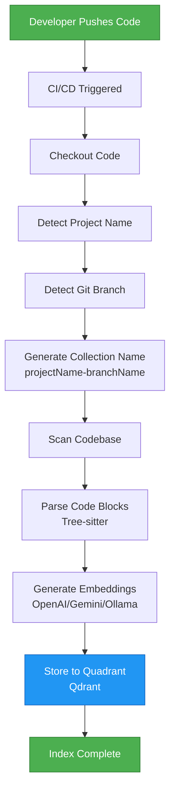
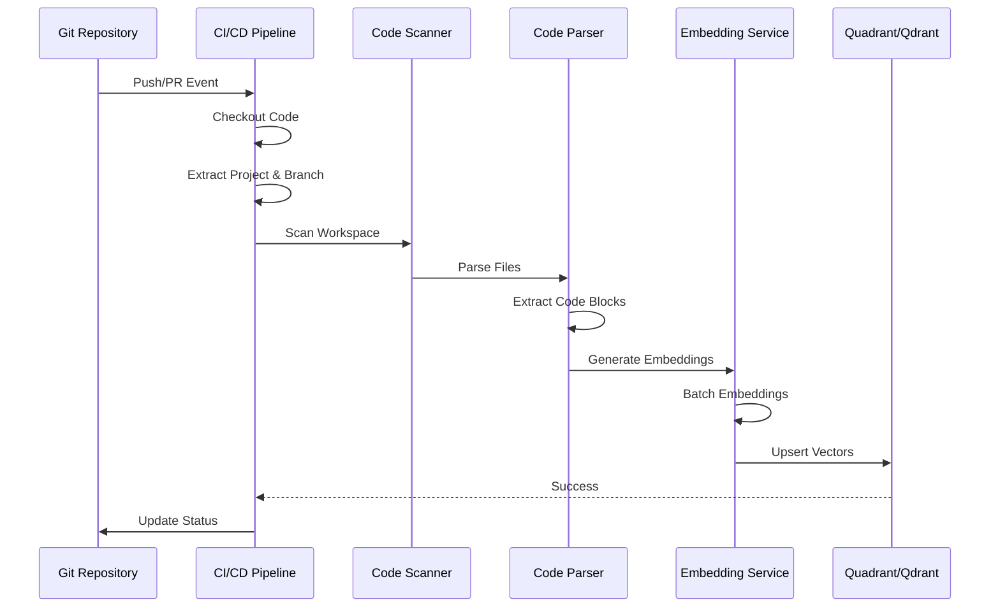
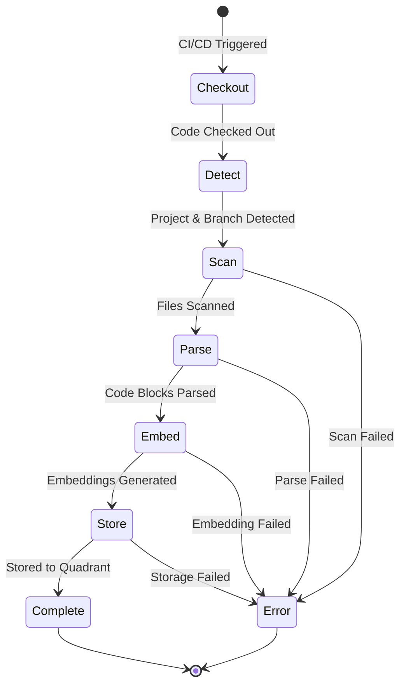

# CI/CD Plan: Automatic Code Indexing to Quadrant

## 📋 Executive Summary

This plan outlines how to automatically index code changes to Quadrant (Qdrant) in CI/CD pipelines, ensuring the central team index stays up-to-date without manual intervention.

## 🎯 Goals

1. **Automated Indexing**: Automatically index code on every push/PR
2. **Branch-Based Collections**: Create/update collections per branch (`projectName-branchName`)
3. **Incremental Updates**: Only index changed files (efficient)
4. **Team Synchronization**: Keep central index synchronized with codebase
5. **Zero Manual Work**: Fully automated, no developer intervention needed

---

## 🏗️ Architecture Overview



### Component Flow



---

## 🔧 Implementation Options

### Option 1: Standalone CLI Tool (Recommended)

Create a dedicated CLI tool that can be run in CI/CD:

**Pros:**
- ✅ Reusable across different CI/CD platforms
- ✅ Can be tested independently
- ✅ Easy to version and maintain
- ✅ Can be used locally for testing

**Cons:**
- ⚠️ Requires building and publishing the tool
- ⚠️ Need to handle dependencies

### Option 2: Docker Container

Package the indexing logic in a Docker container:

**Pros:**
- ✅ Consistent environment
- ✅ Easy to run in any CI/CD
- ✅ Isolated dependencies

**Cons:**
- ⚠️ Larger image size
- ⚠️ Slower startup time

### Option 3: GitHub Action / GitLab CI Template

Create reusable CI/CD templates:

**Pros:**
- ✅ Easy to use (just add to workflow)
- ✅ Platform-specific optimizations

**Cons:**
- ⚠️ Platform-specific (not portable)
- ⚠️ Harder to test locally

---

## 📦 Recommended Approach: Standalone CLI Tool

### Architecture

```
kilocode-index-cli/
├── src/
│   ├── index.ts              # Main entry point
│   ├── scanner.ts            # Code scanning logic
│   ├── parser.ts             # Code parsing (Tree-sitter)
│   ├── embedder.ts           # Embedding generation
│   ├── qdrant-client.ts      # Qdrant integration
│   ├── git-utils.ts          # Git branch/project detection
│   └── config.ts             # Configuration management
├── package.json
└── README.md
```

### CLI Interface

```bash
kilocode-index [options]

Options:
  --workspace <path>        Workspace directory (default: current directory)
  --qdrant-url <url>        Qdrant server URL (required)
  --qdrant-api-key <key>    Qdrant API key (optional)
  --embedder <type>         Embedder type: openai|gemini|ollama (default: openai)
  --embedder-key <key>      Embedder API key (required)
  --embedder-model <model>  Embedding model (default: text-embedding-3-small)
  --collection-name <name>  Collection name (auto-detected if not provided)
  --incremental             Only index changed files (default: false)
  --batch-size <size>       Batch size for embeddings (default: 100)
  --verbose                 Verbose logging
  --dry-run                 Don't actually index, just show what would be indexed
```

### Example Usage

```bash
# Full index
kilocode-index \
  --workspace . \
  --qdrant-url https://your-qdrant-server.com \
  --qdrant-api-key $QDRANT_API_KEY \
  --embedder openai \
  --embedder-key $OPENAI_API_KEY \
  --embedder-model text-embedding-3-small

# Incremental index (only changed files)
kilocode-index \
  --workspace . \
  --qdrant-url https://your-qdrant-server.com \
  --qdrant-api-key $QDRANT_API_KEY \
  --embedder openai \
  --embedder-key $OPENAI_API_KEY \
  --incremental
```

---

## 🔄 CI/CD Workflow

### GitHub Actions Example

```yaml
name: Index Code to Quadrant

on:
  push:
    branches: [main, develop, 'feature/**']
  pull_request:
    branches: [main, develop]

jobs:
  index-code:
    runs-on: ubuntu-latest
    steps:
      - name: Checkout code
        uses: actions/checkout@v4
        with:
          fetch-depth: 0  # Full history for incremental indexing

      - name: Setup Node.js
        uses: actions/setup-node@v4
        with:
          node-version: '20'

      - name: Install kilocode-index CLI
        run: |
          npm install -g @kilocode/index-cli

      - name: Index code to Quadrant
        env:
          QDRANT_URL: ${{ secrets.QDRANT_URL }}
          QDRANT_API_KEY: ${{ secrets.QDRANT_API_KEY }}
          OPENAI_API_KEY: ${{ secrets.OPENAI_API_KEY }}
        run: |
          kilocode-index \
            --workspace . \
            --qdrant-url $QDRANT_URL \
            --qdrant-api-key $QDRANT_API_KEY \
            --embedder openai \
            --embedder-key $OPENAI_API_KEY \
            --embedder-model text-embedding-3-small \
            --incremental \
            --verbose

      - name: Report status
        if: failure()
        run: |
          echo "Indexing failed. Check logs above."
          exit 1
```

### GitLab CI Example

```yaml
index-to-quadrant:
  image: node:20
  stage: index
  only:
    - main
    - develop
    - /^feature\/.*$/
  before_script:
    - npm install -g @kilocode/index-cli
  script:
    - |
      kilocode-index \
        --workspace . \
        --qdrant-url $QDRANT_URL \
        --qdrant-api-key $QDRANT_API_KEY \
        --embedder openai \
        --embedder-key $OPENAI_API_KEY \
        --embedder-model text-embedding-3-small \
        --incremental \
        --verbose
  variables:
    QDRANT_URL: "https://your-qdrant-server.com"
```

### Jenkins Pipeline Example

```groovy
pipeline {
    agent any
    
    environment {
        QDRANT_URL = credentials('qdrant-url')
        QDRANT_API_KEY = credentials('qdrant-api-key')
        OPENAI_API_KEY = credentials('openai-api-key')
    }
    
    stages {
        stage('Checkout') {
            steps {
                checkout scm
            }
        }
        
        stage('Index to Quadrant') {
            steps {
                sh '''
                    npm install -g @kilocode/index-cli
                    kilocode-index \\
                        --workspace . \\
                        --qdrant-url $QDRANT_URL \\
                        --qdrant-api-key $QDRANT_API_KEY \\
                        --embedder openai \\
                        --embedder-key $OPENAI_API_KEY \\
                        --incremental \\
                        --verbose
                '''
            }
        }
    }
}
```

---

## 🔑 Key Implementation Details

### 1. Collection Naming

Follow the same naming convention as the extension:
- Format: `{projectName}-{branchName}`
- Example: `BookMyShow-Clone-master`
- Auto-detected from git repository

### 2. Incremental Indexing

**Strategy:**
- Compare file hashes with previous commit
- Only index changed/new files
- Delete indexes for removed files
- Use git diff to detect changes

**Implementation:**
```typescript
// Pseudo-code
const changedFiles = await getChangedFiles(commitHash)
const deletedFiles = await getDeletedFiles(commitHash)

// Index changed files
for (const file of changedFiles) {
  await indexFile(file)
}

// Delete removed files
for (const file of deletedFiles) {
  await deleteFromIndex(file)
}
```

### 3. Batch Processing

- Process files in batches (default: 100 files)
- Generate embeddings in batches (respect API limits)
- Upsert to Qdrant in batches (efficient)

### 4. Error Handling

- Retry failed batches (exponential backoff)
- Log errors but continue processing
- Report final status (success/failure count)

### 5. Progress Reporting

- Log progress to CI/CD console
- Show files processed, embeddings generated
- Report timing information

---

## 📊 Workflow States



---

## 🛠️ Implementation Steps

### Phase 1: Core CLI Tool (Week 1-2)

1. **Create CLI project structure**
   - Set up TypeScript project
   - Add dependencies (Tree-sitter, Qdrant client, etc.)
   - Create basic CLI interface

2. **Implement core components**
   - Code scanner (reuse from extension)
   - Code parser (Tree-sitter integration)
   - Embedder wrapper (OpenAI/Gemini/Ollama)
   - Qdrant client (reuse from extension)

3. **Add Git integration**
   - Branch detection
   - Project name detection
   - Changed files detection
   - Incremental indexing logic

4. **Testing**
   - Unit tests for each component
   - Integration tests
   - Local testing with sample projects

### Phase 2: CI/CD Integration (Week 3)

1. **Create CI/CD templates**
   - GitHub Actions workflow
   - GitLab CI template
   - Jenkins pipeline script

2. **Documentation**
   - Setup guide
   - Configuration examples
   - Troubleshooting guide

3. **Publishing**
   - Publish to npm as `@kilocode/index-cli`
   - Create Docker image (optional)
   - Version and tag releases

### Phase 3: Optimization & Monitoring (Week 4)

1. **Performance optimization**
   - Parallel processing
   - Caching strategies
   - Batch size tuning

2. **Monitoring**
   - Add metrics/logging
   - Error reporting
   - Performance tracking

3. **Documentation**
   - Complete user guide
   - Best practices
   - FAQ

---

## 🔐 Security Considerations

### Secrets Management

- **Never commit API keys** to repository
- Use CI/CD secrets management:
  - GitHub: Repository secrets
  - GitLab: CI/CD variables (masked)
  - Jenkins: Credentials plugin

### Access Control

- Qdrant API key with limited permissions
- Embedder API keys with usage limits
- Network security (VPN/firewall for Qdrant)

### Data Privacy

- Consider what code is indexed
- Exclude sensitive files (`.env`, secrets, etc.)
- Respect `.gitignore` patterns

---

## 📈 Benefits

### For Developers

- ✅ **Zero Manual Work**: Indexing happens automatically
- ✅ **Always Up-to-Date**: Central index reflects latest code
- ✅ **Fast Onboarding**: New developers get indexed codebase immediately
- ✅ **Branch Support**: Each branch gets its own index

### For Teams

- ✅ **Consistent Indexing**: Same process for all projects
- ✅ **Scalable**: Handles large codebases automatically
- ✅ **Reliable**: CI/CD ensures indexing happens
- ✅ **Traceable**: Indexing history in CI/CD logs

### For Organizations

- ✅ **Centralized**: Single source of truth (Quadrant)
- ✅ **Cost-Effective**: Batch processing reduces API costs
- ✅ **Maintainable**: Automated reduces manual maintenance
- ✅ **Auditable**: CI/CD logs provide audit trail

---

## ⚠️ Challenges & Solutions

### Challenge 1: Large Codebases

**Problem**: Indexing entire codebase takes too long

**Solutions**:
- Incremental indexing (only changed files)
- Parallel processing
- Caching unchanged files
- Skip generated files (build outputs)

### Challenge 2: API Rate Limits

**Problem**: Embedding API has rate limits

**Solutions**:
- Batch processing with delays
- Exponential backoff on errors
- Queue system for large batches
- Use faster/cheaper models for initial indexing

### Challenge 3: Cost Management

**Problem**: Embedding API costs can be high

**Solutions**:
- Incremental indexing (only changes)
- Use cost-effective models
- Cache embeddings for unchanged code
- Monitor and alert on usage

### Challenge 4: Branch Management

**Problem**: Too many branches = too many collections

**Solutions**:
- Auto-cleanup old branch collections
- Index only main/develop branches
- Configurable branch patterns
- Periodic cleanup job

---

## 🎯 Success Metrics

- **Indexing Time**: < 5 minutes for typical project
- **Success Rate**: > 95% of CI/CD runs succeed
- **Coverage**: 100% of changed files indexed
- **Cost**: < $0.10 per indexing run (for typical project)

---

## 📝 Configuration Example

### `.kilocode-index.yml` (Optional)

```yaml
# KiloCode Index Configuration
workspace: .

# Quadrant Configuration
qdrant:
  url: ${QDRANT_URL}
  apiKey: ${QDRANT_API_KEY}
  collectionPrefix: ""  # Optional prefix for collections

# Embedder Configuration
embedder:
  type: openai  # openai | gemini | ollama
  apiKey: ${OPENAI_API_KEY}
  model: text-embedding-3-small
  batchSize: 100

# Indexing Configuration
indexing:
  incremental: true
  batchSize: 100
  maxConcurrency: 5
  excludePatterns:
    - "node_modules/**"
    - "dist/**"
    - "build/**"
    - "*.min.js"
    - "*.min.css"

# Git Configuration
git:
  branchPattern: "**"  # Which branches to index
  skipBranches:
    - "dependabot/**"
    - "renovate/**"
```

---

## 🚀 Quick Start Guide

### 1. Install CLI Tool

```bash
npm install -g @kilocode/index-cli
```

### 2. Configure Secrets

Add to your CI/CD secrets:
- `QDRANT_URL`: Your Qdrant server URL
- `QDRANT_API_KEY`: Qdrant API key
- `OPENAI_API_KEY`: OpenAI API key (or other embedder key)

### 3. Add CI/CD Workflow

Copy the GitHub Actions workflow above to `.github/workflows/index-to-quadrant.yml`

### 4. Test Locally

```bash
kilocode-index \
  --workspace . \
  --qdrant-url $QDRANT_URL \
  --qdrant-api-key $QDRANT_API_KEY \
  --embedder openai \
  --embedder-key $OPENAI_API_KEY \
  --dry-run
```

### 5. Push and Verify

- Push code to trigger CI/CD
- Check CI/CD logs for indexing progress
- Verify collection in Qdrant dashboard

---

## 📚 Next Steps

1. **Review this plan** with team
2. **Decide on implementation approach** (CLI tool recommended)
3. **Set up Qdrant server** (if not already done)
4. **Create CLI tool** (Phase 1)
5. **Test with sample project**
6. **Integrate into CI/CD** (Phase 2)
7. **Monitor and optimize** (Phase 3)

---

## 🔗 Related Documentation

- [Hybrid Vector Store Architecture](./HYBRID_VECTOR_STORE_ARCHITECTURE.md)
- [Complete System Architecture](./COMPLETE_SYSTEM_ARCHITECTURE.md)
- [LanceDB Storage and Cleanup](./LANCEDB_STORAGE_AND_CLEANUP.md)

---

**Document Version**: 1.0  
**Last Updated**: 2024  
**Status**: Planning Phase

