# Complete System Architecture

## Code Indexing & Semantic Search System

---

## 📋 Table of Contents

1. [Executive Summary](#executive-summary)
2. [System Overview](#system-overview)
3. [Architecture Components](#architecture-components)
4. [Mode Selection & Decision Flow](#mode-selection--decision-flow)
5. [Hybrid Mode Architecture](#hybrid-mode-architecture)
6. [LanceDB-Only Mode Architecture](#lancedb-only-mode-architecture)
7. [Complete Data Flow](#complete-data-flow)
8. [Component Details](#component-details)
9. [Integration Points](#integration-points)
10. [Performance Characteristics](#performance-characteristics)
11. [Technical Specifications](#technical-specifications)

---

## 📊 Executive Summary

### System Purpose

The Code Indexing & Semantic Search System is an intelligent VS Code extension that provides real-time code indexing and semantic search capabilities. It automatically detects project context (Git branch, project name) and intelligently routes between team-shared indexes (Quadrant) and local indexes (LanceDB) to provide developers with instant, accurate code search results.

### Key Capabilities

- ✅ **Automatic Mode Selection**: Intelligently chooses between Hybrid (team) and LanceDB-only (local) modes
- ✅ **Real-Time Indexing**: Monitors file changes and indexes them instantly
- ✅ **Semantic Search**: Vector-based similarity search across entire codebase
- ✅ **Team Collaboration**: Shared central index for team members
- ✅ **Local Development**: Instant indexing of local changes
- ✅ **Zero Configuration**: Auto-detects Git branch, project name, and available indexes

### Value Proposition

- **For Developers**: Instant code search with full context, no waiting for CI/CD
- **For Teams**: Shared knowledge base with automatic synchronization
- **For Organizations**: Reduced onboarding time, improved code discovery

---

## 🏗️ System Overview

### High-Level Architecture

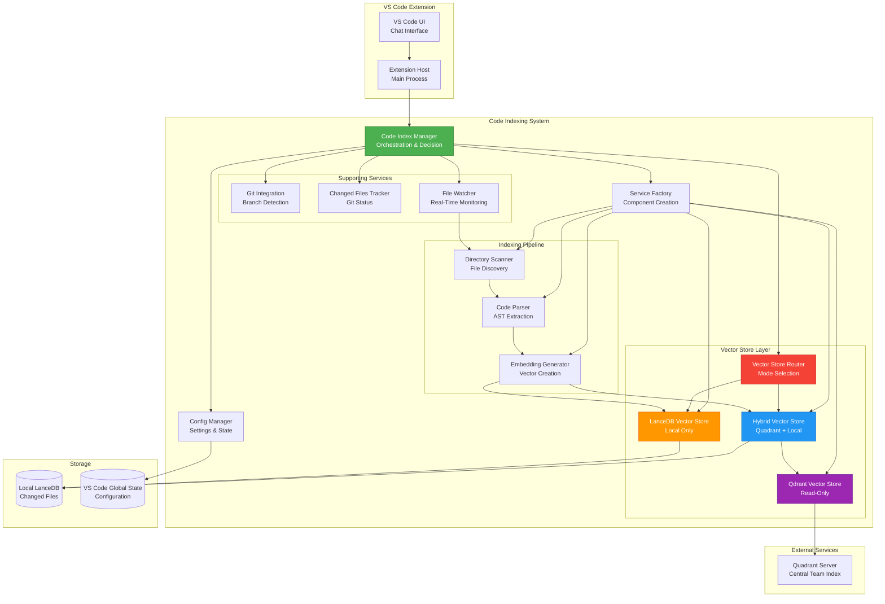
```mermaid
graph TB
    subgraph "VS Code Extension"
        UI[VS Code UI<br/>Chat Interface]
        Extension[Extension Host<br/>Main Process]
    end

    subgraph "Code Indexing System"
        Manager[Code Index Manager<br/>Orchestration & Decision]
        Factory[Service Factory<br/>Component Creation]
        Config[Config Manager<br/>Settings & State]

        subgraph "Indexing Pipeline"
            Scanner[Directory Scanner<br/>File Discovery]
            Parser[Code Parser<br/>AST Extraction]
            Embedder[Embedding Generator<br/>Vector Creation]
        end

        subgraph "Vector Store Layer"
            Router[Vector Store Router<br/>Mode Selection]
            Hybrid[Hybrid Vector Store<br/>Quadrant + Local]
            LanceDB[LanceDB Vector Store<br/>Local Only]
            Qdrant[Qdrant Vector Store<br/>Read-Only]
        end

        subgraph "Supporting Services"
            Git[Git Integration<br/>Branch Detection]
            Tracker[Changed Files Tracker<br/>Git Status]
            Watcher[File Watcher<br/>Real-Time Monitoring]
        end
    end

    subgraph "External Services"
        Quadrant[Quadrant Server<br/>Central Team Index]
    end

    subgraph "Storage"
        LocalDB[(Local LanceDB<br/>Changed Files)]
        GlobalState[(VS Code Global State<br/>Configuration)]
    end

    UI --> Extension
    Extension --> Manager
    Manager --> Factory
    Manager --> Config
    Manager --> Router

    Factory --> Scanner
    Factory --> Parser
    Factory --> Embedder
    Factory --> Hybrid
    Factory --> LanceDB
    Factory --> Qdrant

    Router --> Hybrid
    Router --> LanceDB

    Hybrid --> Qdrant
    Hybrid --> LocalDB
    LanceDB --> LocalDB

    Qdrant --> Quadrant

    Manager --> Git
    Manager --> Tracker
    Manager --> Watcher

    Config --> GlobalState

    Watcher --> Scanner
    Scanner --> Parser
    Parser --> Embedder
    Embedder --> Hybrid
    Embedder --> LanceDB

    style Manager fill:#4CAF50,stroke:#2E7D32,color:#fff
    style Hybrid fill:#2196F3,stroke:#1565C0,color:#fff
    style LanceDB fill:#FF9800,stroke:#E65100,color:#fff
    style Qdrant fill:#9C27B0,stroke:#6A1B9A,color:#fff
    style Router fill:#F44336,stroke:#C62828,color:#fff
```

### System Layers

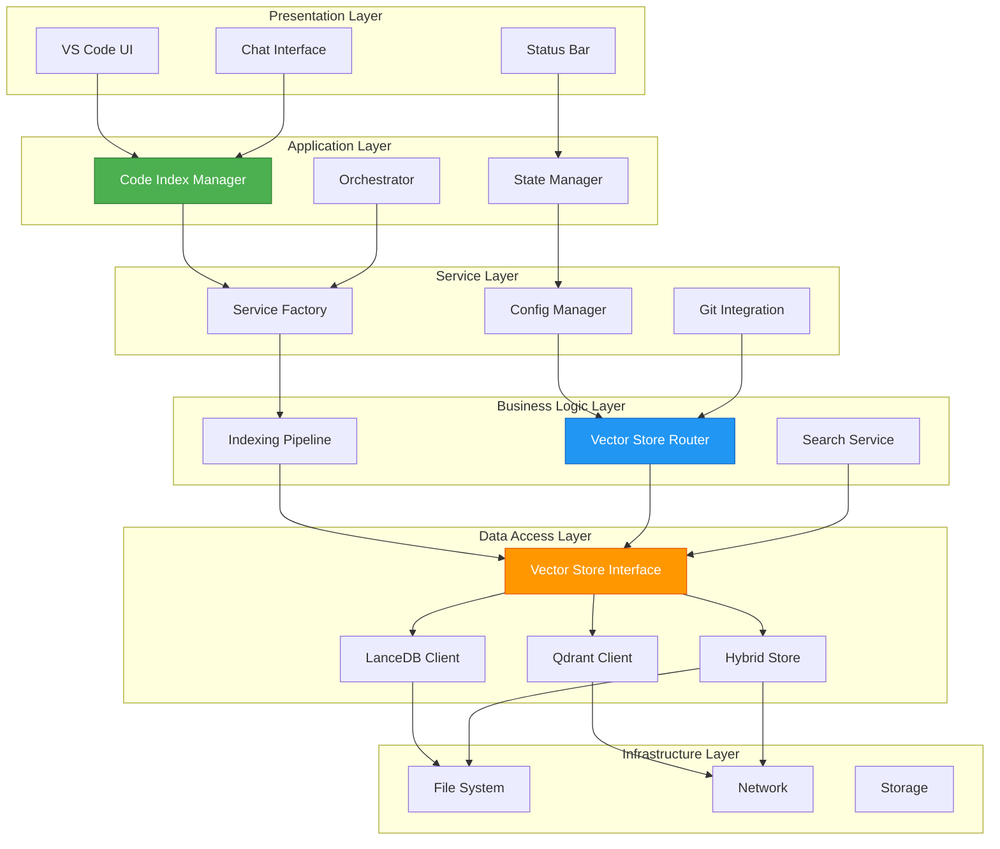
```mermaid
graph TD
    subgraph "Presentation Layer"
        P1[VS Code UI]
        P2[Chat Interface]
        P3[Status Bar]
    end

    subgraph "Application Layer"
        A1[Code Index Manager]
        A2[Orchestrator]
        A3[State Manager]
    end

    subgraph "Service Layer"
        S1[Service Factory]
        S2[Config Manager]
        S3[Git Integration]
    end

    subgraph "Business Logic Layer"
        B1[Indexing Pipeline]
        B2[Vector Store Router]
        B3[Search Service]
    end

    subgraph "Data Access Layer"
        D1[Vector Store Interface]
        D2[LanceDB Client]
        D3[Qdrant Client]
        D4[Hybrid Store]
    end

    subgraph "Infrastructure Layer"
        I1[File System]
        I2[Network]
        I3[Storage]
    end

    P1 --> A1
    P2 --> A1
    P3 --> A3

    A1 --> S1
    A2 --> S1
    A3 --> S2

    S1 --> B1
    S2 --> B2
    S3 --> B2

    B1 --> D1
    B2 --> D1
    B3 --> D1

    D1 --> D2
    D1 --> D3
    D1 --> D4

    D2 --> I1
    D3 --> I2
    D4 --> I1
    D4 --> I2

    style A1 fill:#4CAF50,stroke:#2E7D32,color:#fff
    style B2 fill:#2196F3,stroke:#1565C0,color:#fff
    style D1 fill:#FF9800,stroke:#E65100,color:#fff
```

---

## 🧩 Architecture Components

### Core Components

#### 1. Code Index Manager

**Purpose**: Central orchestration and decision-making

**Responsibilities**:

- System initialization
- Mode selection (Hybrid vs LanceDB-only)
- Configuration management
- Service lifecycle management
- UI state synchronization

**Key Methods**:

- `initialize()`: System startup and mode detection
- `_persistConfigChangeAndRefreshUI()`: Configuration persistence
- `_recreateServices()`: Service recreation on config change

#### 2. Service Factory

**Purpose**: Creates and configures service instances

**Responsibilities**:

- Vector store creation (Hybrid, LanceDB, Qdrant)
- Indexing pipeline component creation
- Dependency injection
- Configuration application

**Key Methods**:

- `createVectorStore()`: Creates appropriate vector store based on config
- `createOrchestrator()`: Creates indexing orchestrator
- `createEmbedder()`: Creates embedding service

#### 3. Config Manager

**Purpose**: Manages configuration and state

**Responsibilities**:

- Load/save configuration
- Persist to VS Code global state
- Configuration validation
- Default value management

**Key Properties**:

- `vectorStoreType`: "qdrant" | "lancedb"
- `enableHybridMode`: boolean
- `customCollectionName`: string
- `qdrantUrl`: string
- `lanceDbPath`: string

#### 4. Orchestrator

**Purpose**: Manages indexing workflow

**Responsibilities**:

- File scanning coordination
- Batch processing
- Progress reporting
- File watcher management

**Key Methods**:

- `startIndexing()`: Full workspace indexing
- `startFileWatcherOnly()`: File watcher only (hybrid mode)
- `stopIndexing()`: Stop all indexing

#### 5. Vector Store Router

**Purpose**: Routes operations to appropriate store

**Responsibilities**:

- Mode selection logic
- Store initialization
- Operation routing
- Result aggregation

---

## 🔀 Mode Selection & Decision Flow

### Complete Decision Tree

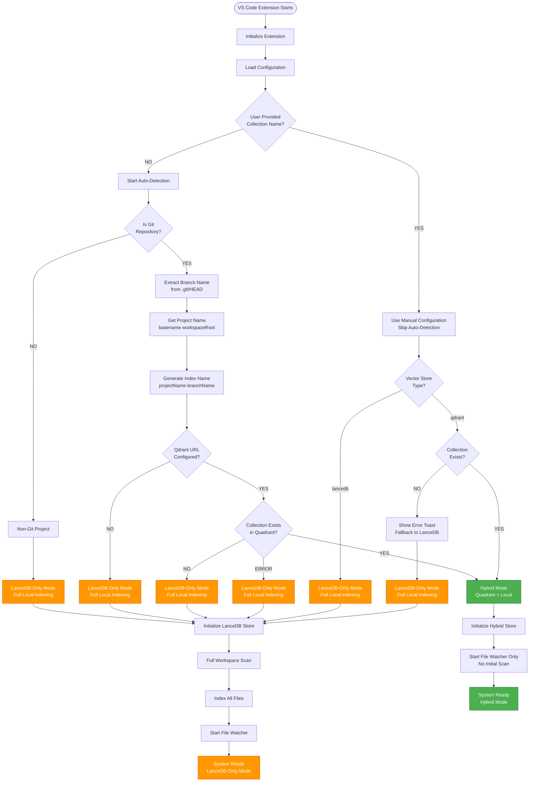
```mermaid
flowchart TD
    Start([VS Code Extension Starts]) --> Init[Initialize Extension]
    Init --> LoadConfig[Load Configuration]
    LoadConfig --> CheckManual{User Provided<br/>Collection Name?}

    CheckManual -->|YES| UseManual[Use Manual Configuration<br/>Skip Auto-Detection]
    CheckManual -->|NO| AutoDetect[Start Auto-Detection]

    AutoDetect --> CheckGit{Is Git<br/>Repository?}

    CheckGit -->|NO| NonGit[Non-Git Project]
    NonGit --> LanceDBOnly1[LanceDB-Only Mode<br/>Full Local Indexing]

    CheckGit -->|YES| ExtractBranch[Extract Branch Name<br/>from .git/HEAD]
    ExtractBranch --> GetProject[Get Project Name<br/>basename workspaceRoot]
    GetProject --> GenerateName[Generate Index Name<br/>projectName-branchName]

    GenerateName --> CheckQdrant{Qdrant URL<br/>Configured?}

    CheckQdrant -->|NO| LanceDBOnly2[LanceDB-Only Mode<br/>Full Local Indexing]

    CheckQdrant -->|YES| CheckCollection{Collection Exists<br/>in Quadrant?}

    CheckCollection -->|YES| HybridMode[Hybrid Mode<br/>Quadrant + Local]
    CheckCollection -->|NO| LanceDBOnly3[LanceDB-Only Mode<br/>Full Local Indexing]
    CheckCollection -->|ERROR| LanceDBOnly4[LanceDB-Only Mode<br/>Full Local Indexing]

    UseManual --> CheckType{Vector Store<br/>Type?}
    CheckType -->|qdrant| CheckManualQdrant{Collection<br/>Exists?}
    CheckType -->|lancedb| LanceDBOnly5[LanceDB-Only Mode<br/>Full Local Indexing]

    CheckManualQdrant -->|YES| HybridMode
    CheckManualQdrant -->|NO| ShowError[Show Error Toast<br/>Fallback to LanceDB]
    ShowError --> LanceDBOnly6[LanceDB-Only Mode<br/>Full Local Indexing]

    HybridMode --> InitHybrid[Initialize Hybrid Store]
    LanceDBOnly1 --> InitLanceDB[Initialize LanceDB Store]
    LanceDBOnly2 --> InitLanceDB
    LanceDBOnly3 --> InitLanceDB
    LanceDBOnly4 --> InitLanceDB
    LanceDBOnly5 --> InitLanceDB
    LanceDBOnly6 --> InitLanceDB

    InitHybrid --> StartFW1[Start File Watcher Only<br/>No Initial Scan]
    InitLanceDB --> FullScan[Full Workspace Scan]
    FullScan --> IndexAll[Index All Files]
    IndexAll --> StartFW2[Start File Watcher]

    StartFW1 --> Ready1[System Ready<br/>Hybrid Mode]
    StartFW2 --> Ready2[System Ready<br/>LanceDB-Only Mode]

    style HybridMode fill:#4CAF50,stroke:#2E7D32,color:#fff
    style LanceDBOnly1 fill:#FF9800,stroke:#E65100,color:#fff
    style LanceDBOnly2 fill:#FF9800,stroke:#E65100,color:#fff
    style LanceDBOnly3 fill:#FF9800,stroke:#E65100,color:#fff
    style LanceDBOnly4 fill:#FF9800,stroke:#E65100,color:#fff
    style LanceDBOnly5 fill:#FF9800,stroke:#E65100,color:#fff
    style LanceDBOnly6 fill:#FF9800,stroke:#E65100,color:#fff
    style Ready1 fill:#4CAF50,stroke:#2E7D32,color:#fff
    style Ready2 fill:#FF9800,stroke:#E65100,color:#fff
```

### Mode Selection Logic

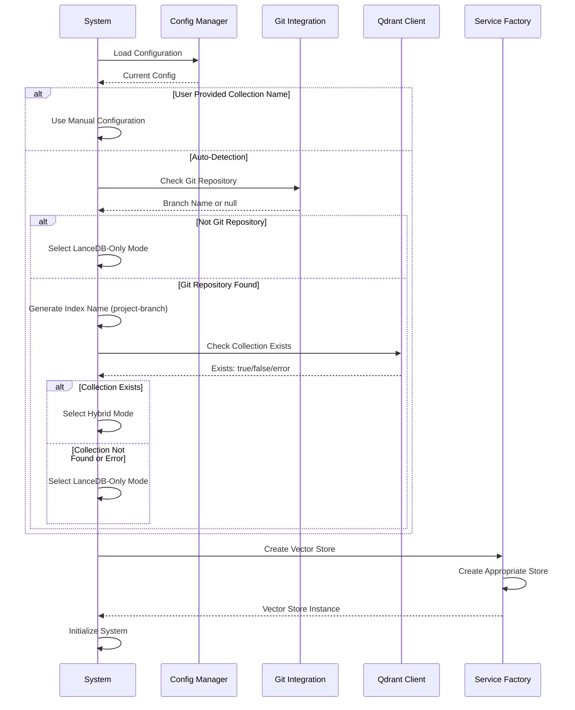
```mermaid
sequenceDiagram
    participant System as System
    participant Config as Config Manager
    participant Git as Git Integration
    participant Qdrant as Qdrant Client
    participant Factory as Service Factory

    System->>Config: Load Configuration
    Config-->>System: Current Config

    alt User Provided Collection Name
        System->>System: Use Manual Configuration
    else Auto-Detection
        System->>Git: Check Git Repository
        Git-->>System: Branch Name or null

        alt Not Git Repository
            System->>System: Select LanceDB-Only Mode
        else Git Repository Found
            System->>System: Generate Index Name (project-branch)
            System->>Qdrant: Check Collection Exists
            Qdrant-->>System: Exists: true/false/error

            alt Collection Exists
                System->>System: Select Hybrid Mode
            else Collection Not Found or Error
                System->>System: Select LanceDB-Only Mode
            end
        end
    end

    System->>Factory: Create Vector Store
    Factory->>Factory: Create Appropriate Store
    Factory-->>System: Vector Store Instance

    System->>System: Initialize System
```

---

## 🔄 Hybrid Mode Architecture

### Hybrid Mode Overview

Hybrid mode combines a **read-only central team index (Quadrant)** with a **writable local index (LanceDB)** for changed files. This provides the best of both worlds: team context + real-time local changes.

### Hybrid Mode Architecture Diagram

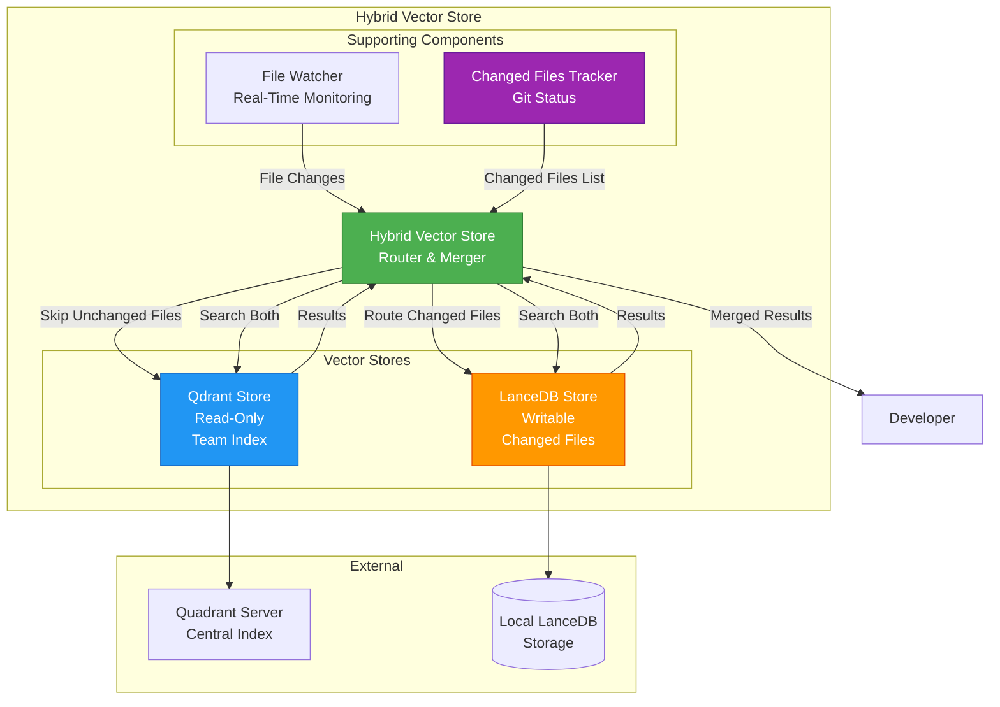
```mermaid
graph TB
    subgraph "Hybrid Vector Store"
        HVS[Hybrid Vector Store<br/>Router & Merger]

        subgraph "Vector Stores"
            QS[Qdrant Store<br/>Read-Only<br/>Team Index]
            LS[LanceDB Store<br/>Writable<br/>Changed Files]
        end

        subgraph "Supporting Components"
            CFT[Changed Files Tracker<br/>Git Status]
            FW[File Watcher<br/>Real-Time Monitoring]
        end
    end

    subgraph "External"
        Quadrant[Quadrant Server<br/>Central Index]
        LocalDB[(Local LanceDB<br/>Storage)]
    end

    FW -->|File Changes| HVS
    CFT -->|Changed Files List| HVS

    HVS -->|Route Changed Files| LS
    HVS -->|Skip Unchanged Files| QS
    HVS -->|Search Both| QS
    HVS -->|Search Both| LS

    QS --> Quadrant
    LS --> LocalDB

    QS -->|Results| HVS
    LS -->|Results| HVS
    HVS -->|Merged Results| User[Developer]

    style HVS fill:#4CAF50,stroke:#2E7D32,color:#fff
    style QS fill:#2196F3,stroke:#1565C0,color:#fff
    style LS fill:#FF9800,stroke:#E65100,color:#fff
    style CFT fill:#9C27B0,stroke:#6A1B9A,color:#fff
```

### Hybrid Mode Initialization Flow

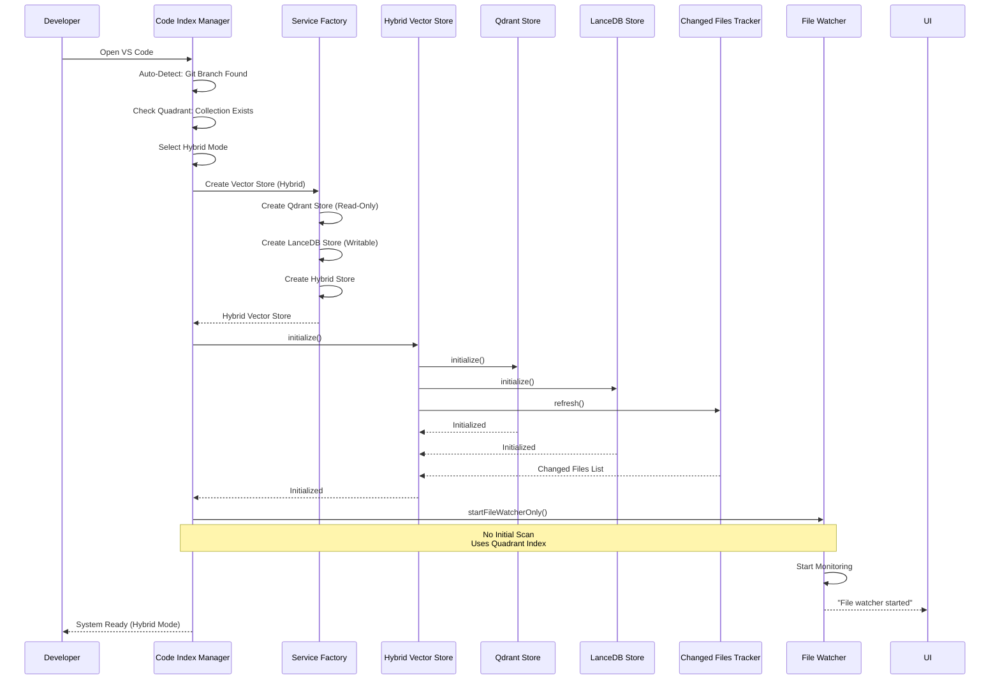
```mermaid
sequenceDiagram
    participant Dev as Developer
    participant Manager as Code Index Manager
    participant Factory as Service Factory
    participant Hybrid as Hybrid Vector Store
    participant Qdrant as Qdrant Store
    participant LanceDB as LanceDB Store
    participant Tracker as Changed Files Tracker
    participant Watcher as File Watcher
    participant UI as UI

    Dev->>Manager: Open VS Code
    Manager->>Manager: Auto-Detect: Git Branch Found
    Manager->>Manager: Check Quadrant: Collection Exists
    Manager->>Manager: Select Hybrid Mode

    Manager->>Factory: Create Vector Store (Hybrid)
    Factory->>Factory: Create Qdrant Store (Read-Only)
    Factory->>Factory: Create LanceDB Store (Writable)
    Factory->>Factory: Create Hybrid Store
    Factory-->>Manager: Hybrid Vector Store

    Manager->>Hybrid: initialize()
    Hybrid->>Qdrant: initialize()
    Hybrid->>LanceDB: initialize()
    Hybrid->>Tracker: refresh()

    Qdrant-->>Hybrid: Initialized
    LanceDB-->>Hybrid: Initialized
    Tracker-->>Hybrid: Changed Files List

    Hybrid-->>Manager: Initialized

    Manager->>Watcher: startFileWatcherOnly()
    Note over Manager,Watcher: No Initial Scan<br/>Uses Quadrant Index

    Watcher->>Watcher: Start Monitoring
    Watcher-->>UI: "File watcher started"
    Manager-->>Dev: System Ready (Hybrid Mode)
```

### Hybrid Mode File Change Flow

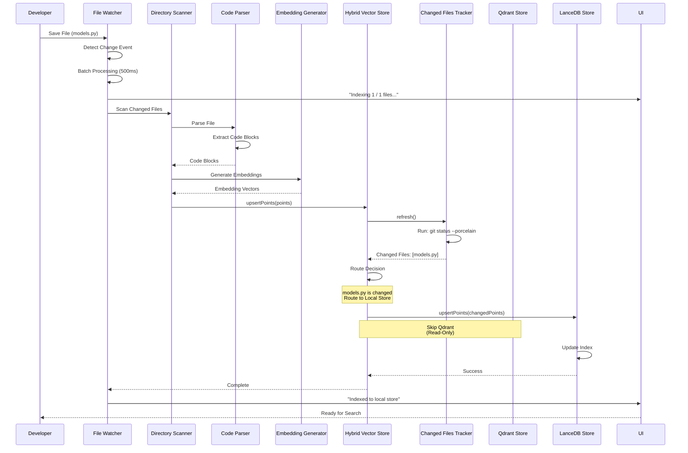
```mermaid
sequenceDiagram
    participant Dev as Developer
    participant Watcher as File Watcher
    participant Scanner as Directory Scanner
    participant Parser as Code Parser
    participant Embedder as Embedding Generator
    participant Hybrid as Hybrid Vector Store
    participant Tracker as Changed Files Tracker
    participant Qdrant as Qdrant Store
    participant LanceDB as LanceDB Store
    participant UI as UI

    Dev->>Watcher: Save File (models.py)
    Watcher->>Watcher: Detect Change Event
    Watcher->>Watcher: Batch Processing (500ms)
    Watcher->>UI: "Indexing 1 / 1 files..."

    Watcher->>Scanner: Scan Changed Files
    Scanner->>Parser: Parse File
    Parser->>Parser: Extract Code Blocks
    Parser-->>Scanner: Code Blocks

    Scanner->>Embedder: Generate Embeddings
    Embedder-->>Scanner: Embedding Vectors

    Scanner->>Hybrid: upsertPoints(points)

    Hybrid->>Tracker: refresh()
    Tracker->>Tracker: Run: git status --porcelain
    Tracker-->>Hybrid: Changed Files: [models.py]

    Hybrid->>Hybrid: Route Decision
    Note over Hybrid: models.py is changed<br/>Route to Local Store

    Hybrid->>LanceDB: upsertPoints(changedPoints)
    Note over Hybrid,Qdrant: Skip Qdrant<br/>(Read-Only)

    LanceDB->>LanceDB: Update Index
    LanceDB-->>Hybrid: Success

    Hybrid-->>Watcher: Complete
    Watcher->>UI: "Indexed to local store"
    UI-->>Dev: Ready for Search
```

### Hybrid Mode Search Flow

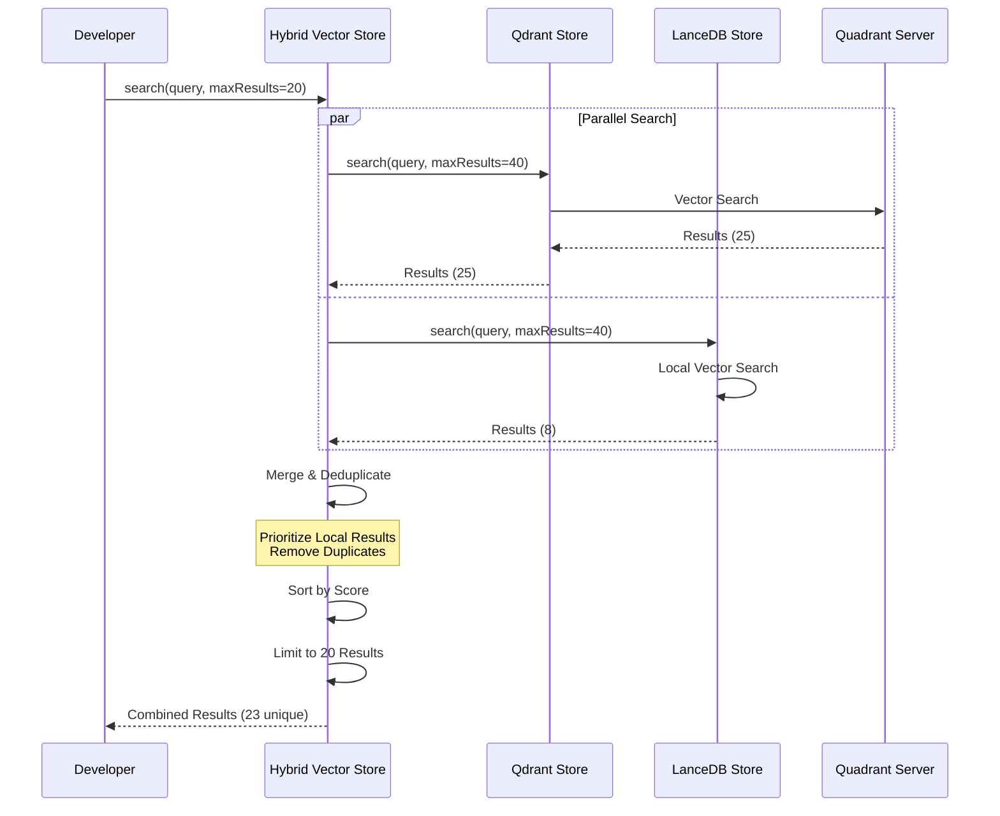
```mermaid
sequenceDiagram
    participant Dev as Developer
    participant Hybrid as Hybrid Vector Store
    participant Qdrant as Qdrant Store
    participant LanceDB as LanceDB Store
    participant Quadrant as Quadrant Server

    Dev->>Hybrid: search(query, maxResults=20)

    par Parallel Search
        Hybrid->>Qdrant: search(query, maxResults=40)
        Qdrant->>Quadrant: Vector Search
        Quadrant-->>Qdrant: Results (25)
        Qdrant-->>Hybrid: Results (25)
    and
        Hybrid->>LanceDB: search(query, maxResults=40)
        LanceDB->>LanceDB: Local Vector Search
        LanceDB-->>Hybrid: Results (8)
    end

    Hybrid->>Hybrid: Merge & Deduplicate
    Note over Hybrid: Prioritize Local Results<br/>Remove Duplicates

    Hybrid->>Hybrid: Sort by Score
    Hybrid->>Hybrid: Limit to 20 Results

    Hybrid-->>Dev: Combined Results (23 unique)
```

### Hybrid Mode Data Flow

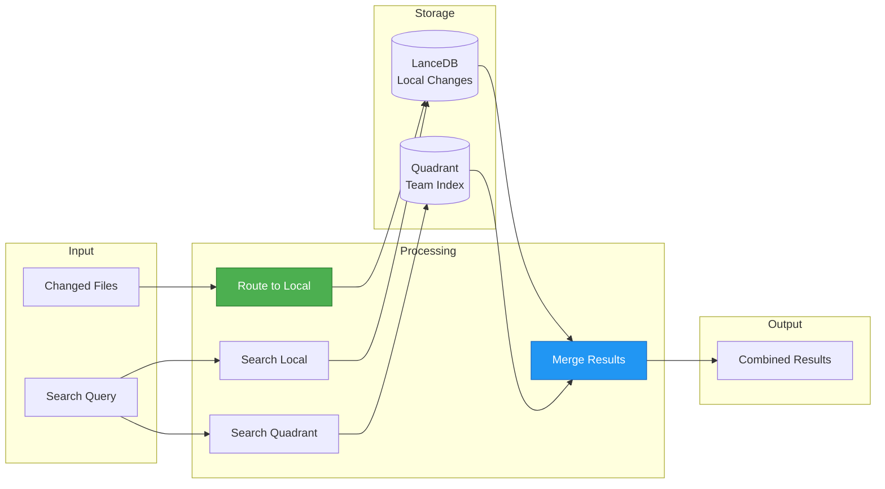
```mermaid
flowchart LR
    subgraph "Input"
        Files[Changed Files]
        Query[Search Query]
    end

    subgraph "Processing"
        Route[Route to Local]
        SearchQ[Search Quadrant]
        SearchL[Search Local]
        Merge[Merge Results]
    end

    subgraph "Storage"
        Quadrant[(Quadrant<br/>Team Index)]
        Local[(LanceDB<br/>Local Changes)]
    end

    subgraph "Output"
        Results[Combined Results]
    end

    Files --> Route
    Route --> Local

    Query --> SearchQ
    Query --> SearchL

    SearchQ --> Quadrant
    SearchL --> Local

    Quadrant --> Merge
    Local --> Merge

    Merge --> Results

    style Route fill:#4CAF50,stroke:#2E7D32,color:#fff
    style Merge fill:#2196F3,stroke:#1565C0,color:#fff
```

---

## 🗄️ LanceDB-Only Mode Architecture

### LanceDB-Only Mode Overview

LanceDB-only mode provides a **complete local indexing solution** when Quadrant is not available. It indexes the entire workspace locally and provides fast, offline-capable search.

### LanceDB-Only Mode Architecture Diagram

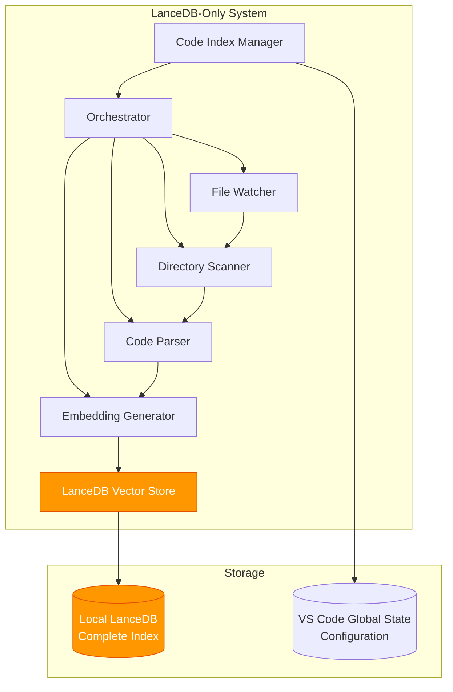
```mermaid
graph TB
    subgraph "LanceDB-Only System"
        Manager[Code Index Manager]
        Orchestrator[Orchestrator]
        Scanner[Directory Scanner]
        Parser[Code Parser]
        Embedder[Embedding Generator]
        LanceDB[LanceDB Vector Store]
        Watcher[File Watcher]
    end

    subgraph "Storage"
        LocalDB[(Local LanceDB<br/>Complete Index)]
        Config[(VS Code Global State<br/>Configuration)]
    end

    Manager --> Orchestrator
    Orchestrator --> Scanner
    Orchestrator --> Parser
    Orchestrator --> Embedder
    Orchestrator --> Watcher

    Scanner --> Parser
    Parser --> Embedder
    Embedder --> LanceDB
    Watcher --> Scanner

    LanceDB --> LocalDB
    Manager --> Config

    style LanceDB fill:#FF9800,stroke:#E65100,color:#fff
    style LocalDB fill:#FF9800,stroke:#E65100,color:#fff
```

### LanceDB-Only Mode Initialization Flow

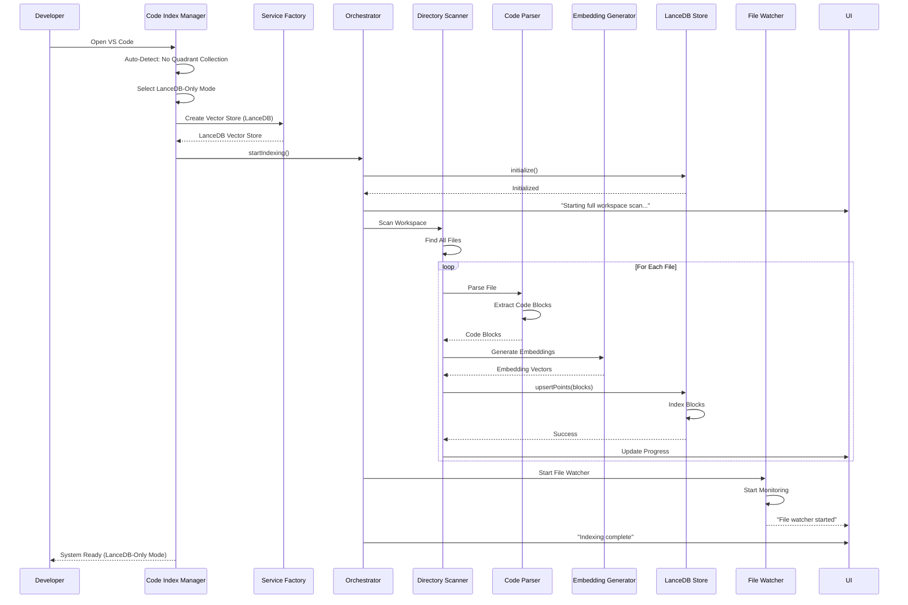
```mermaid
sequenceDiagram
    participant Dev as Developer
    participant Manager as Code Index Manager
    participant Factory as Service Factory
    participant Orchestrator as Orchestrator
    participant Scanner as Directory Scanner
    participant Parser as Code Parser
    participant Embedder as Embedding Generator
    participant LanceDB as LanceDB Store
    participant Watcher as File Watcher
    participant UI as UI

    Dev->>Manager: Open VS Code
    Manager->>Manager: Auto-Detect: No Quadrant Collection
    Manager->>Manager: Select LanceDB-Only Mode

    Manager->>Factory: Create Vector Store (LanceDB)
    Factory-->>Manager: LanceDB Vector Store

    Manager->>Orchestrator: startIndexing()
    Orchestrator->>LanceDB: initialize()
    LanceDB-->>Orchestrator: Initialized

    Orchestrator->>UI: "Starting full workspace scan..."
    Orchestrator->>Scanner: Scan Workspace
    Scanner->>Scanner: Find All Files

    loop For Each File
        Scanner->>Parser: Parse File
        Parser->>Parser: Extract Code Blocks
        Parser-->>Scanner: Code Blocks

        Scanner->>Embedder: Generate Embeddings
        Embedder-->>Scanner: Embedding Vectors

        Scanner->>LanceDB: upsertPoints(blocks)
        LanceDB->>LanceDB: Index Blocks
        LanceDB-->>Scanner: Success

        Scanner->>UI: Update Progress
    end

    Orchestrator->>Watcher: Start File Watcher
    Watcher->>Watcher: Start Monitoring
    Watcher-->>UI: "File watcher started"

    Orchestrator->>UI: "Indexing complete"
    Manager-->>Dev: System Ready (LanceDB-Only Mode)
```

### LanceDB-Only Mode File Change Flow

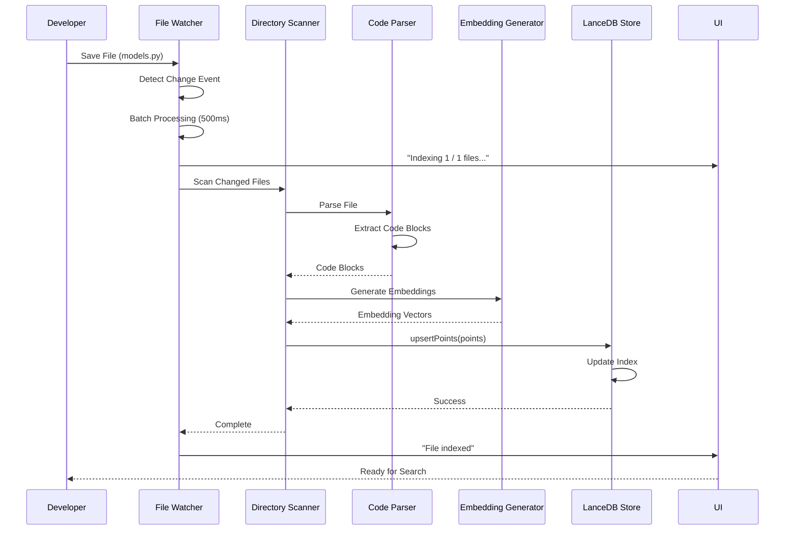
```mermaid
sequenceDiagram
    participant Dev as Developer
    participant Watcher as File Watcher
    participant Scanner as Directory Scanner
    participant Parser as Code Parser
    participant Embedder as Embedding Generator
    participant LanceDB as LanceDB Store
    participant UI as UI

    Dev->>Watcher: Save File (models.py)
    Watcher->>Watcher: Detect Change Event
    Watcher->>Watcher: Batch Processing (500ms)
    Watcher->>UI: "Indexing 1 / 1 files..."

    Watcher->>Scanner: Scan Changed Files
    Scanner->>Parser: Parse File
    Parser->>Parser: Extract Code Blocks
    Parser-->>Scanner: Code Blocks

    Scanner->>Embedder: Generate Embeddings
    Embedder-->>Scanner: Embedding Vectors

    Scanner->>LanceDB: upsertPoints(points)
    LanceDB->>LanceDB: Update Index
    LanceDB-->>Scanner: Success

    Scanner-->>Watcher: Complete
    Watcher->>UI: "File indexed"
    UI-->>Dev: Ready for Search
```

### LanceDB-Only Mode Search Flow

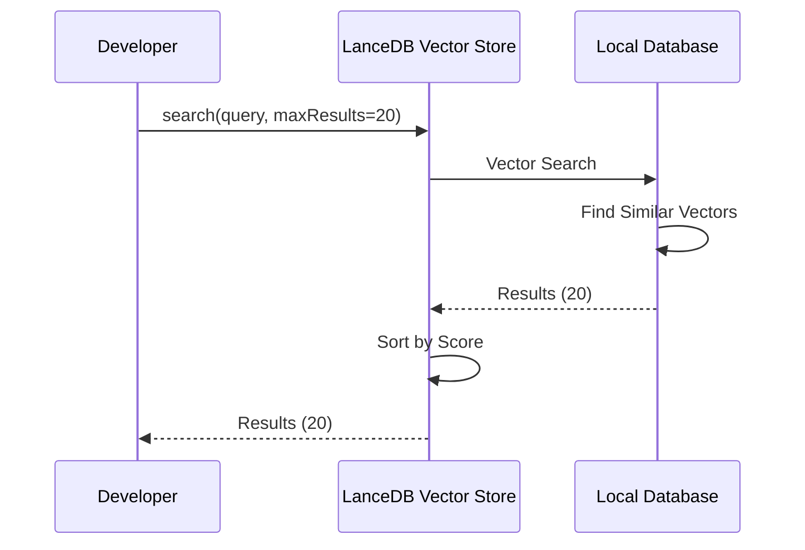
```mermaid
sequenceDiagram
    participant Dev as Developer
    participant LanceDB as LanceDB Vector Store
    participant LocalDB as Local Database

    Dev->>LanceDB: search(query, maxResults=20)
    LanceDB->>LocalDB: Vector Search
    LocalDB->>LocalDB: Find Similar Vectors
    LocalDB-->>LanceDB: Results (20)
    LanceDB->>LanceDB: Sort by Score
    LanceDB-->>Dev: Results (20)
```

### LanceDB-Only Mode Data Flow

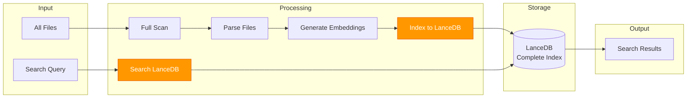
```mermaid
flowchart LR
    subgraph "Input"
        Files[All Files]
        Query[Search Query]
    end

    subgraph "Processing"
        Scan[Full Scan]
        Parse[Parse Files]
        Embed[Generate Embeddings]
        Index[Index to LanceDB]
        Search[Search LanceDB]
    end

    subgraph "Storage"
        Local[(LanceDB<br/>Complete Index)]
    end

    subgraph "Output"
        Results[Search Results]
    end

    Files --> Scan
    Scan --> Parse
    Parse --> Embed
    Embed --> Index
    Index --> Local

    Query --> Search
    Search --> Local
    Local --> Results

    style Index fill:#FF9800,stroke:#E65100,color:#fff
    style Search fill:#FF9800,stroke:#E65100,color:#fff
```

---

## 🔄 Complete Data Flow

### End-to-End Data Flow

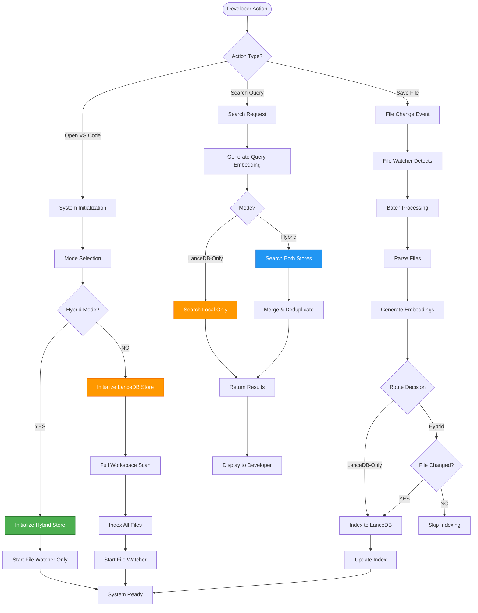
```mermaid
flowchart TD
    Start([Developer Action]) --> Action{Action Type?}

    Action -->|Open VS Code| Init[System Initialization]
    Action -->|Save File| Change[File Change Event]
    Action -->|Search Query| Search[Search Request]

    Init --> Mode[Mode Selection]
    Mode --> Hybrid{Hybrid Mode?}

    Hybrid -->|YES| InitH[Initialize Hybrid Store]
    Hybrid -->|NO| InitL[Initialize LanceDB Store]

    InitH --> FWH[Start File Watcher Only]
    InitL --> Scan[Full Workspace Scan]
    Scan --> Index[Index All Files]
    Index --> FWL[Start File Watcher]

    FWH --> Ready[System Ready]
    FWL --> Ready

    Change --> Detect[File Watcher Detects]
    Detect --> Batch[Batch Processing]
    Batch --> Parse[Parse Files]
    Parse --> Embed[Generate Embeddings]
    Embed --> Route{Route Decision}

    Route -->|Hybrid| Check{File Changed?}
    Route -->|LanceDB-Only| Local[Index to LanceDB]

    Check -->|YES| Local
    Check -->|NO| Skip[Skip Indexing]

    Local --> Update[Update Index]
    Update --> Ready

    Search --> Generate[Generate Query Embedding]
    Generate --> SearchMode{Mode?}

    SearchMode -->|Hybrid| SearchBoth[Search Both Stores]
    SearchMode -->|LanceDB-Only| SearchLocal[Search Local Only]

    SearchBoth --> Merge[Merge & Deduplicate]
    SearchLocal --> Results[Return Results]
    Merge --> Results

    Results --> Display[Display to Developer]

    style InitH fill:#4CAF50,stroke:#2E7D32,color:#fff
    style InitL fill:#FF9800,stroke:#E65100,color:#fff
    style SearchBoth fill:#2196F3,stroke:#1565C0,color:#fff
    style SearchLocal fill:#FF9800,stroke:#E65100,color:#fff
```

### Indexing Pipeline Flow

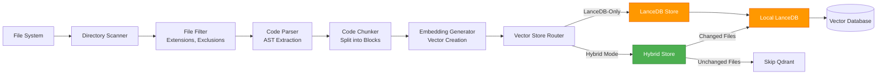
```mermaid
flowchart LR
    Input[File System] --> Scanner[Directory Scanner]
    Scanner --> Filter[File Filter<br/>Extensions, Exclusions]
    Filter --> Parser[Code Parser<br/>AST Extraction]
    Parser --> Chunker[Code Chunker<br/>Split into Blocks]
    Chunker --> Embedder[Embedding Generator<br/>Vector Creation]
    Embedder --> Router[Vector Store Router]

    Router -->|Hybrid Mode| Hybrid[Hybrid Store]
    Router -->|LanceDB-Only| LanceDB[LanceDB Store]

    Hybrid -->|Changed Files| Local[Local LanceDB]
    Hybrid -->|Unchanged Files| Skip[Skip Qdrant]

    LanceDB --> Local

    Local --> Storage[(Vector Database)]

    style Hybrid fill:#4CAF50,stroke:#2E7D32,color:#fff
    style LanceDB fill:#FF9800,stroke:#E65100,color:#fff
    style Local fill:#FF9800,stroke:#E65100,color:#fff
```

### Search Pipeline Flow

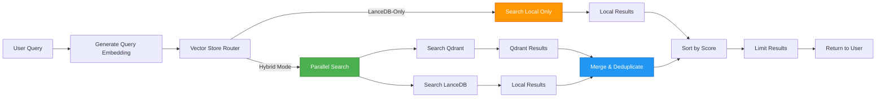
```mermaid
flowchart LR
    Query[User Query] --> Embed[Generate Query Embedding]
    Embed --> Router[Vector Store Router]

    Router -->|Hybrid Mode| Parallel[Parallel Search]
    Router -->|LanceDB-Only| Local[Search Local Only]

    Parallel --> Qdrant[Search Qdrant]
    Parallel --> LanceDB[Search LanceDB]

    Qdrant --> Results1[Qdrant Results]
    LanceDB --> Results2[Local Results]

    Results1 --> Merge[Merge & Deduplicate]
    Results2 --> Merge

    Local --> Results3[Local Results]
    Results3 --> Sort[Sort by Score]

    Merge --> Sort
    Sort --> Limit[Limit Results]
    Limit --> Return[Return to User]

    style Parallel fill:#4CAF50,stroke:#2E7D32,color:#fff
    style Merge fill:#2196F3,stroke:#1565C0,color:#fff
    style Local fill:#FF9800,stroke:#E65100,color:#fff
```

---

## 🔧 Component Details

### Vector Store Interface

```typescript
interface IVectorStore {
	initialize(): Promise<boolean>
	isReadOnly(): boolean
	upsertPoints(points: PointStruct[]): Promise<void>
	search(
		queryVector: number[],
		directoryPrefix?: string,
		minScore?: number,
		maxResults?: number,
	): Promise<VectorStoreSearchResult[]>
	deletePointsByFilePath(filePath: string): Promise<void>
	deletePointsByMultipleFilePaths(filePaths: string[]): Promise<void>
	clearCollection(): Promise<void>
	deleteCollection(): Promise<void>
}
```

### Hybrid Vector Store

**Key Methods**:

- `initialize()`: Initializes both Qdrant and LanceDB stores
- `upsertPoints()`: Routes changed files to local, skips unchanged
- `search()`: Searches both stores in parallel, merges results
- `mergeAndDeduplicateResults()`: Combines results, prioritizes local

**Routing Logic**:

```typescript
// Pseudo-code
for (const point of points) {
	const filePath = point.payload?.filePath
	const isChanged = await changedFilesTracker.isFileChanged(filePath)

	if (isChanged) {
		changedFilePoints.push(point) // Route to local
	} else {
		unchangedFilePoints.push(point) // Skip (in Qdrant)
	}
}
```

### Changed Files Tracker

**Purpose**: Detects locally modified files using Git

**Implementation**:

- Uses `git status --porcelain` to detect changes
- Caches results with 5-second TTL
- Normalizes file paths for cross-platform compatibility

**Key Methods**:

- `getChangedFiles()`: Returns set of changed file paths
- `isFileChanged(filePath)`: Checks if specific file is changed
- `refresh()`: Forces refresh of changed files list

### File Watcher

**Purpose**: Monitors file system for changes

**Features**:

- Debounced batch processing (500ms)
- Progress reporting
- Batch size limits
- Error handling

**Events**:

- `onDidStartBatchProcessing`: Batch start
- `onBatchProgressUpdate`: Progress updates
- `onDidFinishBatchProcessing`: Batch complete

---

## 🔌 Integration Points

### VS Code Integration

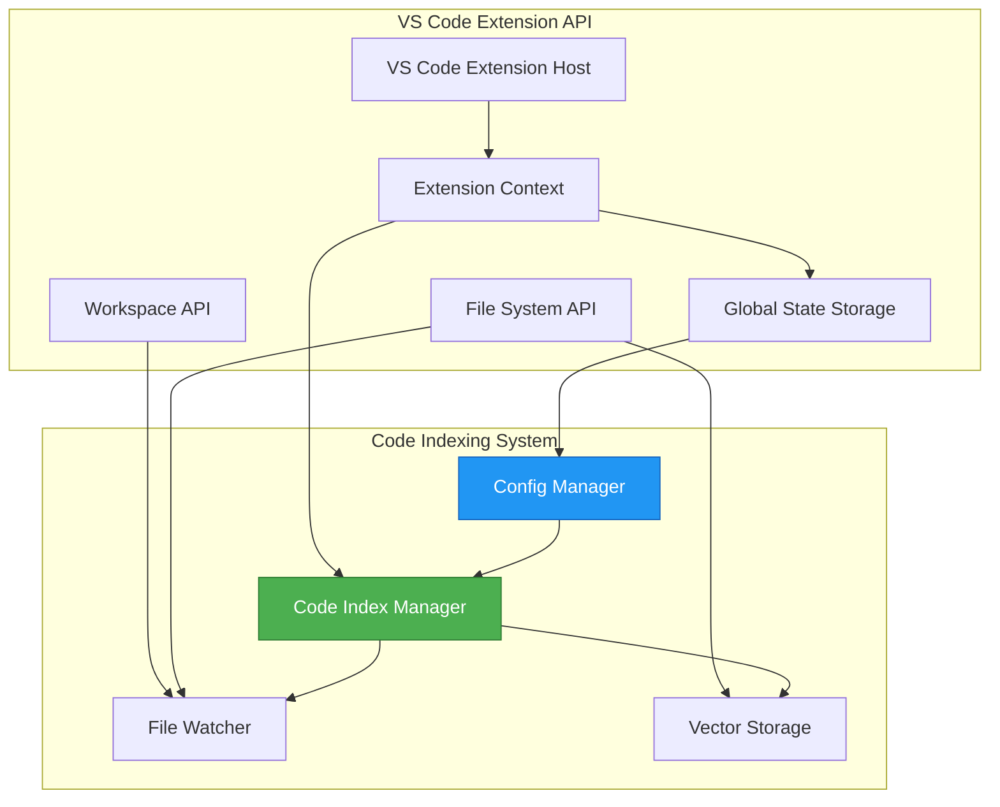
```mermaid
graph TB
    subgraph "VS Code Extension API"
        VSCode[VS Code Extension Host]
        Context[Extension Context]
        GlobalState[Global State Storage]
        FileSystem[File System API]
        Workspace[Workspace API]
    end

    subgraph "Code Indexing System"
        Manager[Code Index Manager]
        Config[Config Manager]
        Watcher[File Watcher]
        Storage[Vector Storage]
    end

    VSCode --> Context
    Context --> Manager
    Context --> GlobalState

    GlobalState --> Config
    Config --> Manager

    Workspace --> Watcher
    FileSystem --> Watcher
    FileSystem --> Storage

    Manager --> Watcher
    Manager --> Storage

    style Manager fill:#4CAF50,stroke:#2E7D32,color:#fff
    style Config fill:#2196F3,stroke:#1565C0,color:#fff
```

### External Service Integration

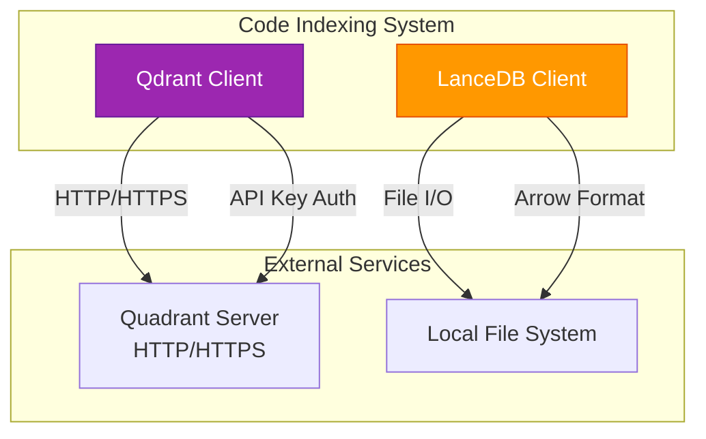
```mermaid
graph TB
    subgraph "Code Indexing System"
        QdrantClient[Qdrant Client]
        LanceDBClient[LanceDB Client]
    end

    subgraph "External Services"
        QuadrantServer[Quadrant Server<br/>HTTP/HTTPS]
        LocalFileSystem[Local File System]
    end

    QdrantClient -->|HTTP/HTTPS| QuadrantServer
    QdrantClient -->|API Key Auth| QuadrantServer

    LanceDBClient -->|File I/O| LocalFileSystem
    LanceDBClient -->|Arrow Format| LocalFileSystem

    style QdrantClient fill:#9C27B0,stroke:#6A1B9A,color:#fff
    style LanceDBClient fill:#FF9800,stroke:#E65100,color:#fff
```

### Git Integration

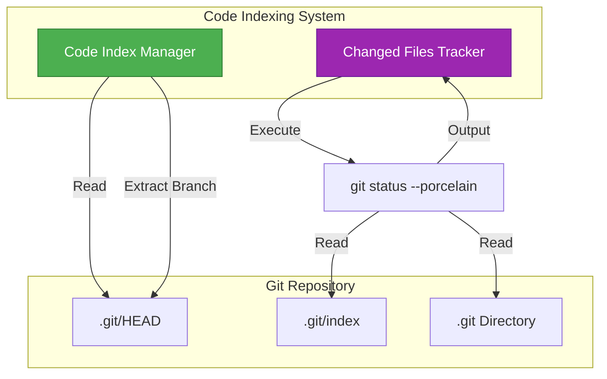
```mermaid
graph TB
    subgraph "Code Indexing System"
        Manager[Code Index Manager]
        Tracker[Changed Files Tracker]
    end

    subgraph "Git Repository"
        GitDir[.git Directory]
        HEAD[.git/HEAD]
        Index[.git/index]
    end

    Manager -->|Read| HEAD
    Manager -->|Extract Branch| HEAD

    Tracker -->|Execute| GitCommand[git status --porcelain]
    GitCommand -->|Read| Index
    GitCommand -->|Read| GitDir
    GitCommand -->|Output| Tracker

    style Manager fill:#4CAF50,stroke:#2E7D32,color:#fff
    style Tracker fill:#9C27B0,stroke:#6A1B9A,color:#fff
```

---

## ⚡ Performance Characteristics

### Indexing Performance

| Operation                | Hybrid Mode                    | LanceDB-Only Mode      |
| ------------------------ | ------------------------------ | ---------------------- |
| **Initial Setup**        | < 1 second (file watcher only) | 30s - 5min (full scan) |
| **File Change Indexing** | < 1 second                     | < 1 second             |
| **Batch Processing**     | 500ms debounce                 | 500ms debounce         |
| **Throughput**           | ~100 files/second              | ~100 files/second      |

### Search Performance

| Operation          | Hybrid Mode | LanceDB-Only Mode |
| ------------------ | ----------- | ----------------- |
| **Qdrant Search**  | 100-300ms   | N/A               |
| **Local Search**   | 50-150ms    | 50-150ms          |
| **Result Merging** | < 10ms      | N/A               |
| **Total Latency**  | 100-300ms   | 50-150ms          |

### Storage Characteristics

| Aspect            | Hybrid Mode                 | LanceDB-Only Mode        |
| ----------------- | --------------------------- | ------------------------ |
| **Local Storage** | Changed files only (5-50MB) | Full codebase (50-500MB) |
| **Network Usage** | Read-only queries           | None                     |
| **Disk I/O**      | Minimal (changed files)     | Moderate (full index)    |

### Scalability

```mermaid
graph TB
    subgraph "Scalability Factors"
        Files[Number of Files]
        Size[Codebase Size]
        Changes[Change Frequency]
        Team[Team Size]
    end

    subgraph "Hybrid Mode"
        H1[Scales with Team<br/>Shared Index]
        H2[Minimal Local Storage<br/>Changed Files Only]
        H3[Fast Setup<br/>No Initial Scan]
    end

    subgraph "LanceDB-Only Mode"
        L1[Scales with Codebase<br/>Full Local Index]
        L2[Moderate Local Storage<br/>Complete Index]
        L3[Initial Scan Required<br/>Depends on Size]
    end

    Files --> H1
    Files --> L1

    Size --> H2
    Size --> L2

    Changes --> H3
    Changes --> L3

    Team --> H1

    style H1 fill:#4CAF50,stroke:#2E7D32,color:#fff
    style L1 fill:#FF9800,stroke:#E65100,color:#fff
```

---

## 📐 Technical Specifications

### System Requirements

- **VS Code**: 1.70.0 or higher
- **Node.js**: 18.0.0 or higher (bundled with VS Code)
- **Platform**: Windows, macOS, Linux
- **Memory**: 2GB RAM minimum, 4GB recommended
- **Disk Space**: 100MB for extension, 50-500MB for local indexes

### Dependencies

#### Core Dependencies

- `@lancedb/lancedb`: ^0.22.3 (vector database)
- `@qdrant/qdrant-js`: ^1.0.0 (Qdrant client)
- `reflect-metadata`: ^0.1.13 (LanceDB requirement)

#### Build Dependencies

- `esbuild`: ^0.19.0 (bundling)
- `typescript`: ^5.0.0 (compilation)
- `vsce`: ^2.0.0 (VSIX packaging)

### Configuration Schema

```typescript
interface CodeIndexConfig {
	// Vector Store Configuration
	vectorStoreType: "qdrant" | "lancedb"
	enableHybridMode: boolean

	// Qdrant Configuration
	qdrantUrl?: string
	qdrantApiKey?: string
	customCollectionName?: string

	// LanceDB Configuration
	lanceDbPath?: string

	// Indexing Configuration
	excludePatterns?: string[]
	includePatterns?: string[]
	maxFileSize?: number
}
```

### Data Structures

#### Point Structure

```typescript
interface PointStruct {
	id: string
	vector: number[]
	payload: {
		filePath: string
		startLine: number
		endLine: number
		text: string
		language?: string
		[key: string]: any
	}
}
```

#### Search Result

```typescript
interface VectorStoreSearchResult {
	id: string
	score: number
	payload: {
		filePath: string
		startLine: number
		endLine: number
		text: string
		language?: string
		[key: string]: any
	}
}
```

### API Endpoints (Qdrant)

- **Collection Check**: `GET /collections/{collection_name}`
- **Vector Search**: `POST /collections/{collection_name}/points/search`
- **Point Upsert**: `POST /collections/{collection_name}/points` (not used in read-only mode)

### File Formats

- **LanceDB**: Apache Arrow format (`.lance` files)
- **Configuration**: JSON (VS Code global state)
- **Embeddings**: Float32Array (1536 dimensions for OpenAI)

---

## 🎯 Summary

### System Capabilities

✅ **Intelligent Mode Selection**: Automatically chooses optimal mode
✅ **Real-Time Indexing**: Instant file change detection and indexing
✅ **Team Collaboration**: Shared central index with local development support
✅ **Offline Capability**: Works without network (LanceDB-only mode)
✅ **Zero Configuration**: Auto-detects project context
✅ **High Performance**: Fast search (< 300ms) and indexing (< 1s per file)

### Architecture Benefits

- **Modularity**: Clear separation of concerns
- **Extensibility**: Easy to add new vector stores
- **Reliability**: Automatic fallback mechanisms
- **Performance**: Parallel processing and caching
- **Developer Experience**: Zero configuration, instant results

### Future Enhancements

- Multi-branch support
- Incremental indexing optimization
- Advanced caching strategies
- Distributed indexing support
- Enhanced conflict resolution

---

**Document Version**: 1.0  
**Last Updated**: 2024  
**Maintained By**: Development Team
