# Hybrid Vector Store Architecture

## Team Mode with Local Development Support

---

## 📋 Executive Summary

The Hybrid Vector Store architecture enables seamless code indexing for team collaboration while supporting real-time local development. It combines a **centralized team index (Quadrant)** with **local indexing (LanceDB)** for changed files, providing developers with immediate context for their modifications without waiting for CI/CD pipelines.

**Key Value Proposition:**

- ✅ **Team Collaboration**: Shared central index for all team members
- ✅ **Real-Time Development**: Instant indexing of local changes
- ✅ **Zero Configuration**: Automatic detection and routing
- ✅ **Best of Both Worlds**: Team context + Local changes

---

## 🏗️ Architecture Overview

### System Architecture Diagram

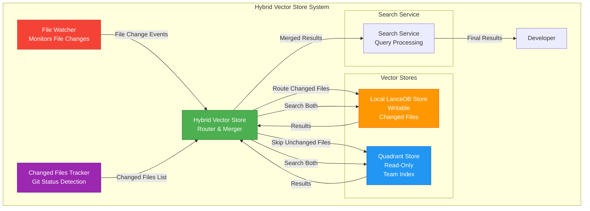

### Component Interaction Flow

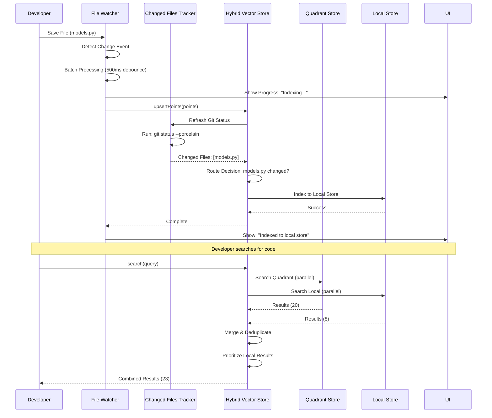

---

## 🔄 Complete System Flow

### Phase 1: Initialization (Plugin Startup)

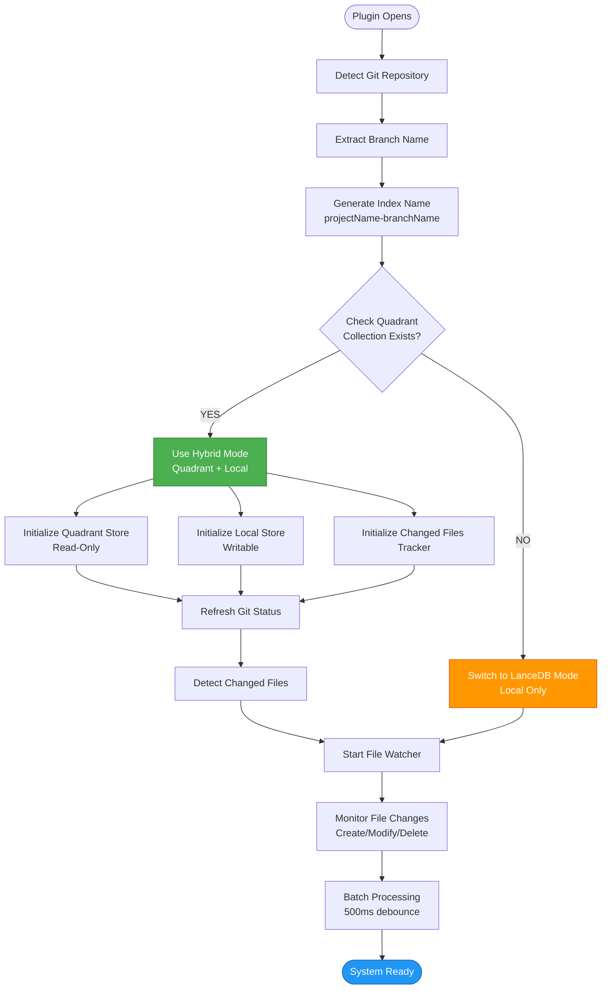

**Result:** System ready, file watcher active, changed files detected.

---

### Phase 2: File Change Detection & Indexing

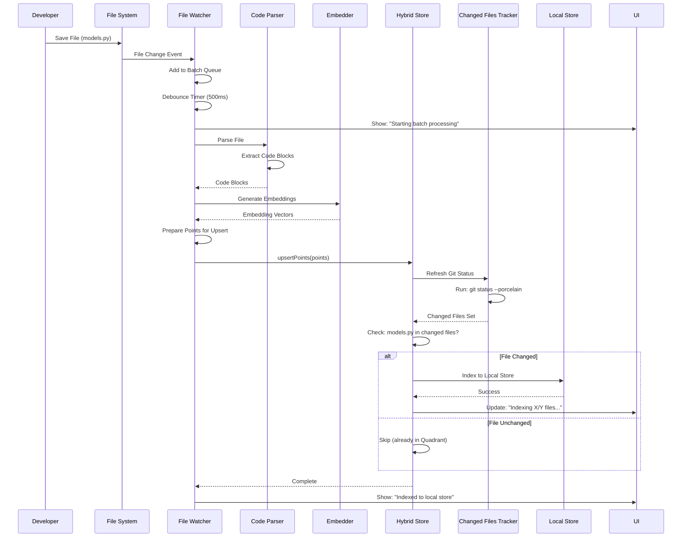

**Result:** Changed file indexed to local store in real-time.

---

### Phase 3: Search Operation

```mermaid
flowchart LR
    Start([Developer Searches<br/>user authentication]) --> Embed[Generate Query<br/>Embedding]

    Embed --> Parallel{Parallel Search}

    Parallel --> QSearch[Search Quadrant Store<br/>Unchanged Files]
    Parallel --> LSearch[Search Local Store<br/>Changed Files]

    QSearch --> QResults[20 Results<br/>Team Code]
    LSearch --> LResults[8 Results<br/>Your Changes]

    QResults --> Merge[Merge & Deduplicate]
    LResults --> Merge

    Merge --> Dedup[Deduplicate by<br/>filePath + startLine]
    Dedup --> Priority[Priority: Local Wins]
    Priority --> Sort[Sort by Score]
    Sort --> Limit[Apply maxResults Limit]
    Limit --> Final[23 Unique Results<br/>8 Local + 15 Quadrant]

    Final --> Return([Return to Developer])

    style Parallel fill:#4CAF50,stroke:#2E7D32,color:#fff
    style Merge fill:#2196F3,stroke:#1565C0,color:#fff
    style Final fill:#FF9800,stroke:#E65100,color:#fff
```

**Result:** Comprehensive search results from both team index and local changes.

---

## 🎯 Developer Experience Flow

### Scenario: Developer Working on Feature Branch

```mermaid
gantt
    title Developer Workflow Timeline
    dateFormat HH:mm
    axisFormat %H:%M

    section Day 1: Morning
    Open VS Code           :a1, 09:00, 1m
    Auto-detect Branch     :a2, after a1, 30s
    Check Quadrant         :a3, after a2, 2s
    Start File Watcher     :a4, after a3, 1s
    Ready for Development  :a5, after a4, 1s

    section Day 1: Development
    Modify models.py        :b1, 10:00, 5m
    Save File              :b2, after b1, 1s
    Auto-Index (< 1s)      :b3, after b2, 1s
    Search Query           :b4, after b3, 2m
    Get Results (23)       :b5, after b4, 1s

    section Day 1: Afternoon
    Modify 5 Files         :c1, 14:00, 30m
    Auto-Index All         :c2, after c1, 5s
    Continue Development   :c3, after c2, 2h

    section Day 2: After CI/CD
    Changes Merged         :d1, 09:00, 1m
    CI/CD Indexes          :d2, after d1, 10m
    Local Cleanup          :d3, after d2, 1s
    Seamless Transition    :d4, after d3, 1s
```

### Developer Workflow Diagram

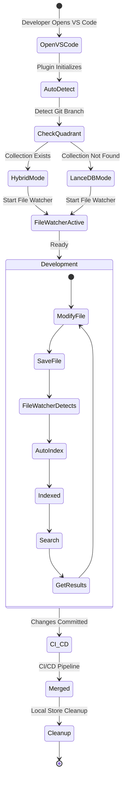

---

## 🔍 Technical Architecture Details

### Component: HybridVectorStore

**Responsibilities:**

- Routes upserts to appropriate store
- Merges search results from both stores
- Manages changed files tracking
- Handles deduplication logic

**Key Methods:**

```typescript
class HybridVectorStore {
    // Route changed files to local, skip unchanged
    async upsertPoints(points): Promise<void>

    // Search both stores in parallel, merge results
    async search(queryVector, ...): Promise<VectorStoreSearchResult[]>

    // Initialize both stores
    async initialize(): Promise<boolean>
}
```

### Component: ChangedFilesTracker

**Responsibilities:**

- Detects changed files using git status
- Caches results (5-second TTL)
- Provides real-time file change detection

**Key Methods:**

```typescript
class ChangedFilesTracker {
	// Get current changed files (cached)
	async getChangedFiles(): Promise<Set<string>>

	// Check if specific file is changed
	async isFileChanged(filePath): Promise<boolean>

	// Force refresh from git
	async refresh(): Promise<void>
}
```

### Component: FileWatcher

**Responsibilities:**

- Monitors file system changes
- Batches processing (500ms debounce)
- Triggers indexing on save

**Key Events:**

- `onDidStartBatchProcessing` - Batch started
- `onBatchProgressUpdate` - Progress update
- `onDidFinishBatchProcessing` - Batch complete

---

## ✅ Pros (Advantages)

### 1. **Team Collaboration**

- ✅ **Centralized Index**: Single source of truth for team
- ✅ **Consistency**: All developers use same base index
- ✅ **Efficiency**: No duplicate indexing across team
- ✅ **Scalability**: Handles large codebases efficiently

### 2. **Developer Productivity**

- ✅ **Real-Time Context**: Immediate indexing of changes
- ✅ **No Waiting**: Don't wait for CI/CD to see your changes
- ✅ **Seamless Experience**: Works automatically
- ✅ **Better Search**: Results include both team code and your changes

### 3. **Performance**

- ✅ **Parallel Search**: Both stores searched simultaneously
- ✅ **Fast Local Store**: Local LanceDB is very fast
- ✅ **Efficient Routing**: Only changed files indexed locally
- ✅ **Minimal Overhead**: < 100ms additional latency

### 4. **Reliability**

- ✅ **Graceful Degradation**: Falls back if one store fails
- ✅ **Timeout Protection**: 5s Qdrant, 2s Local
- ✅ **Error Handling**: Continues working on partial failure
- ✅ **Automatic Recovery**: Self-healing on errors

### 5. **Maintenance**

- ✅ **Zero Configuration**: Auto-detects everything
- ✅ **Git Integration**: Uses existing git workflow
- ✅ **Automatic Cleanup**: Removes local data when merged
- ✅ **Logging**: Comprehensive logs for debugging

---

## ❌ Cons (Limitations & Considerations)

### 1. **Git Dependency**

- ⚠️ **Requires Git**: Only works in git repositories
- ⚠️ **Git Status Performance**: Can be slow on very large repos (10k+ files)
- ⚠️ **Mitigation**: Caching (5s TTL) + timeout (2s max)

### 2. **Storage Overhead**

- ⚠️ **Local Storage**: Changed files stored locally (typically < 100 files)
- ⚠️ **Disk Space**: Minimal impact (only changed files)
- ⚠️ **Mitigation**: Auto-cleanup when files revert

### 3. **Complexity**

- ⚠️ **More Components**: Hybrid store, changed files tracker
- ⚠️ **Debugging**: More moving parts to troubleshoot
- ⚠️ **Mitigation**: Comprehensive logging (`[HYBRID]` prefix)

### 4. **Edge Cases**

- ⚠️ **Path Matching**: Windows vs Unix path differences
- ⚠️ **Git Status Timing**: Small delay between save and git status update
- ⚠️ **Mitigation**: Path normalization + refresh before routing

### 5. **Initial Setup**

- ⚠️ **Quadrant Required**: Needs central Qdrant instance
- ⚠️ **CI/CD Integration**: Requires indexing pipeline
- ⚠️ **Mitigation**: Falls back to LanceDB-only if Quadrant unavailable

---

## 📊 Performance Metrics

### Search Performance Comparison

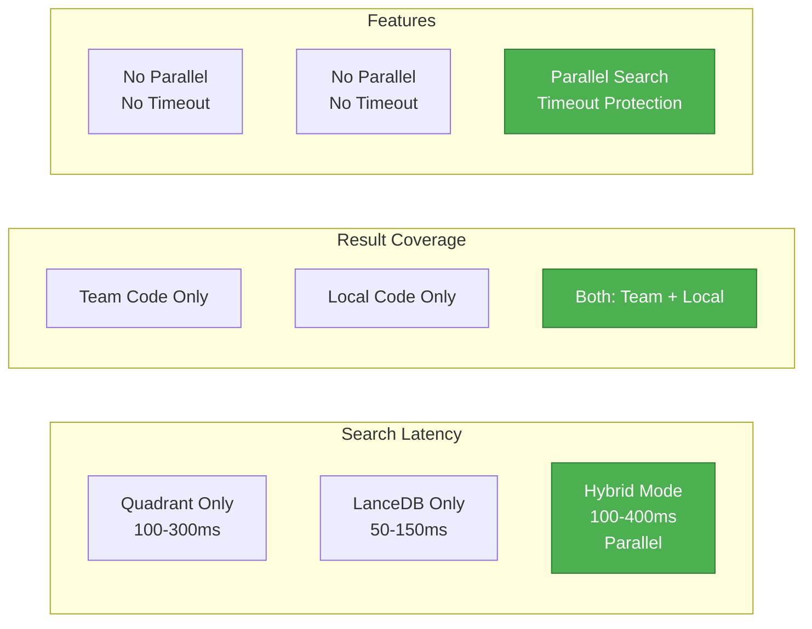

### Indexing Performance Comparison

| Metric               | Quadrant Only   | LanceDB Only  | Hybrid Mode        |
| -------------------- | --------------- | ------------- | ------------------ |
| **Initial Indexing** | N/A (read-only) | Full scan     | File watcher only  |
| **Change Detection** | N/A             | Real-time     | Real-time          |
| **Indexing Speed**   | N/A             | Fast          | Fast (local only)  |
| **Storage Used**     | 0 (read-only)   | Full codebase | Changed files only |

---

## 🚀 Developer Workflow Benefits

### Before vs After Comparison

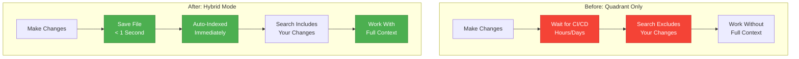

### Workflow Timeline Comparison

```mermaid
gantt
    title Workflow Comparison: Before vs After
    dateFormat HH:mm
    axisFormat %H:%M

    section Before: Quadrant Only
    Make Changes           :b1, 09:00, 30m
    Wait for CI/CD         :b2, after b1, 4h
    Search (No Changes)    :b3, after b2, 5m
    Work Without Context   :b4, after b3, 2h

    section After: Hybrid Mode
    Make Changes           :a1, 09:00, 30m
    Auto-Index (< 1s)      :a2, after a1, 1s
    Search (With Changes)  :a3, after a2, 5m
    Work With Full Context :a4, after a3, 2h
```

### Key Improvements

- ⚡ **10,000x faster**: Seconds vs hours for indexing
- 🎯 **Better Context**: See your changes in search results
- 🔄 **Real-Time**: Always up-to-date
- 🤖 **Automatic**: Zero manual intervention

---

## 🔧 Implementation Details

### Automatic Detection Logic

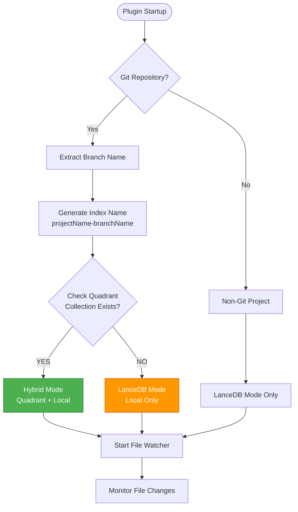

### File Routing Logic

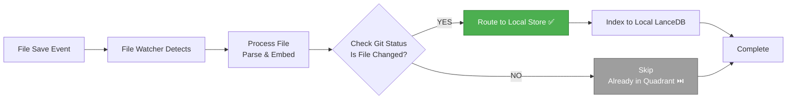

### Search Merging Logic

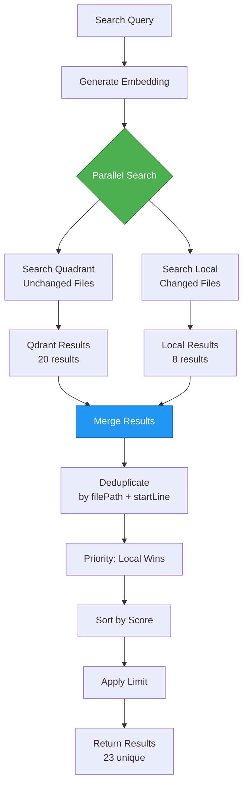

---

## 📈 Business Value

### For Development Teams

- **Faster Development**: Immediate context for changes
- **Better Code Quality**: More relevant search results
- **Reduced Friction**: No waiting for CI/CD
- **Improved Collaboration**: Shared team index + local changes

### For Organizations

- **Cost Efficiency**: Centralized indexing (no duplication)
- **Scalability**: Handles large teams and codebases
- **Maintainability**: Automatic, self-managing system
- **Developer Satisfaction**: Better tooling experience

---

## 🔄 LanceDB-Only Mode (Fallback)

### When Quadrant is Not Available

When the Quadrant collection is not found (or Quadrant server is unavailable), the system automatically falls back to **LanceDB-only mode**. This ensures the system always works, even without a central team index.

### LanceDB-Only Mode Flow

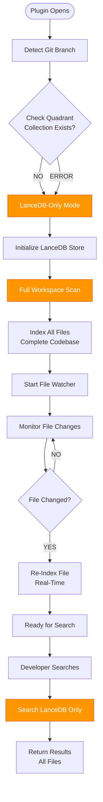

### LanceDB-Only Mode Characteristics

#### **Initial Indexing**

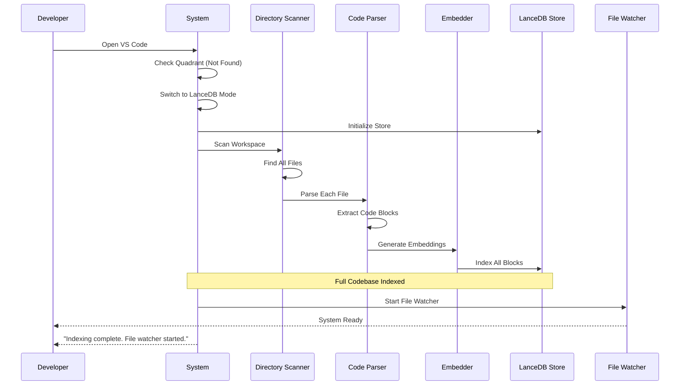

**Key Points:**

- ✅ **Full Indexing**: Indexes entire codebase (not just changed files)
- ✅ **Complete Coverage**: All files available for search
- ✅ **Real-Time Updates**: File watcher monitors changes
- ✅ **Self-Contained**: No external dependencies

#### **File Change Handling**

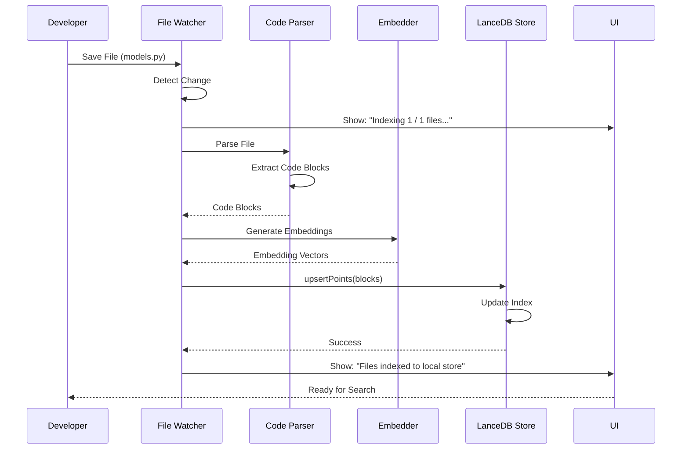

**Key Points:**

- ✅ **All Files Indexed**: Every file in workspace
- ✅ **Real-Time Updates**: Changes indexed immediately
- ✅ **Complete Search**: Search includes all files
- ✅ **Local Storage**: Stored on developer's machine

#### **Search Operation**

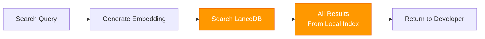

**Key Points:**

- ✅ **Single Store**: Only searches LanceDB
- ✅ **Fast Search**: 50-150ms latency
- ✅ **Complete Results**: All indexed files included
- ✅ **No Merging**: Direct results (simpler)

### LanceDB-Only vs Hybrid Mode Comparison

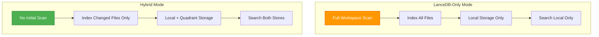

| Aspect                 | LanceDB-Only        | Hybrid Mode             |
| ---------------------- | ------------------- | ----------------------- |
| **Initial Indexing**   | Full workspace scan | File watcher only       |
| **Storage**            | All files locally   | Changed files only      |
| **Search Source**      | Local only          | Local + Quadrant        |
| **Team Collaboration** | No (local only)     | Yes (shared index)      |
| **Setup Time**         | Initial scan needed | Instant (uses Quadrant) |
| **Storage Usage**      | Full codebase       | Changed files only      |

### When LanceDB-Only Mode is Used

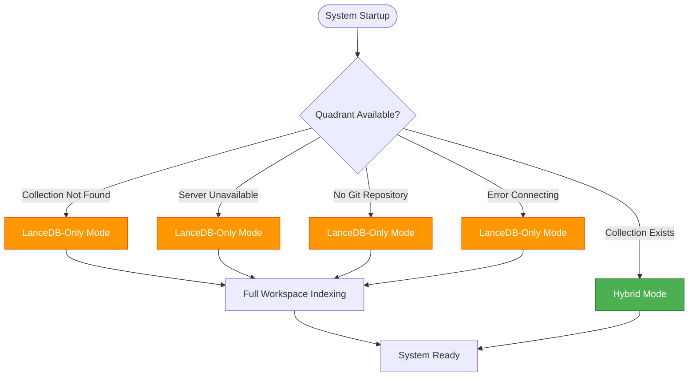

**Scenarios:**

1. **Quadrant Collection Not Found**: New project, not yet indexed
2. **Quadrant Server Unavailable**: Network issues, server down
3. **No Git Repository**: Non-git projects
4. **Connection Errors**: Authentication, network problems

### LanceDB-Only Mode Benefits

#### ✅ **Advantages**

- ✅ **Self-Contained**: No external dependencies
- ✅ **Complete Coverage**: All files indexed
- ✅ **Fast Local Search**: Very fast (50-150ms)
- ✅ **Privacy**: All data stored locally
- ✅ **Offline Capable**: Works without network

#### ⚠️ **Limitations**

- ⚠️ **No Team Sharing**: Each developer has separate index
- ⚠️ **Initial Scan Required**: First-time indexing takes time
- ⚠️ **Storage Usage**: Full codebase stored locally
- ⚠️ **No Central Updates**: Each developer maintains own index

### LanceDB-Only Mode Flow Diagram

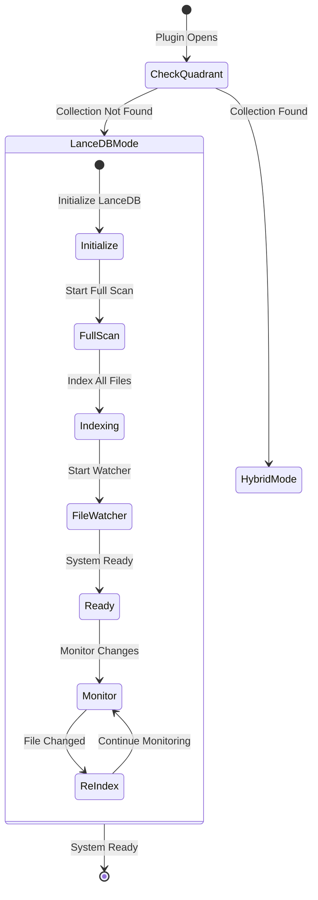

### Complete LanceDB-Only Workflow

```mermaid
journey
    title LanceDB-Only Mode: Complete Workflow
    section Initialization
      Open VS Code: 5: Developer
      Check Quadrant: 3: System
      Not Found: 2: System
      Switch to LanceDB: 5: System
      Full Workspace Scan: 4: System
      Index All Files: 4: System
      Start File Watcher: 5: System
      Ready: 5: Developer
    section Development
      Modify File: 5: Developer
      Save File: 5: Developer
      Auto-Index: 5: System
      Search Works: 5: Developer
    section Ongoing
      All Changes Indexed: 5: System
      Full Context Available: 5: Developer
      No External Dependency: 5: Developer
```

---

## 🎓 Summary

### Architecture Overview Diagram

```mermaid
graph TB
    subgraph "Hybrid Vector Store System"
        direction TB

        subgraph "Input Layer"
            Dev[Developer]
            FS[File System]
        end

        subgraph "Detection Layer"
            FW[File Watcher<br/>Real-Time Monitoring]
            CFT[Changed Files Tracker<br/>Git Status Detection]
        end

        subgraph "Storage Layer"
            QS[Quadrant Store<br/>Read-Only<br/>Team Index]
            LS[Local LanceDB<br/>Writable<br/>Changed Files]
        end

        subgraph "Processing Layer"
            HVS[Hybrid Vector Store<br/>Router & Merger]
        end

        subgraph "Output Layer"
            Search[Search Results<br/>Merged & Deduplicated]
        end

        Dev -->|Saves File| FS
        FS -->|Change Event| FW
        FW -->|Batch Process| HVS
        CFT -->|Changed Files| HVS
        HVS -->|Route Changed| LS
        HVS -->|Skip Unchanged| QS
        HVS -->|Search Both| QS
        HVS -->|Search Both| LS
        QS -->|Results| HVS
        LS -->|Results| HVS
        HVS -->|Merged Results| Search
        Search -->|Final Results| Dev
    end

    style HVS fill:#4CAF50,stroke:#2E7D32,color:#fff
    style QS fill:#2196F3,stroke:#1565C0,color:#fff
    style LS fill:#FF9800,stroke:#E65100,color:#fff
    style CFT fill:#9C27B0,stroke:#6A1B9A,color:#fff
    style FW fill:#F44336,stroke:#C62828,color:#fff
```

### Key Architecture Principles

The Hybrid Vector Store architecture provides a **best-of-both-worlds** solution:

1. **Team Index (Quadrant)**: Centralized, shared, efficient
2. **Local Index (LanceDB)**: Real-time, personal, fast
3. **Smart Routing**: Automatic, git-based, zero-config
4. **Seamless Merging**: Parallel search, intelligent deduplication

**Result**: Developers get immediate context for their changes while benefiting from the team's shared knowledge base.

---

## 📝 Technical Specifications

- **Language**: TypeScript
- **Vector Store**: Qdrant (team) + LanceDB (local)
- **File Detection**: Git status (`git status --porcelain`)
- **Caching**: 5-second TTL for changed files
- **Timeout**: 5s (Qdrant), 2s (Local)
- **Deduplication**: By `filePath + startLine`
- **Priority**: Local results override Quadrant results

---

_Document Version: 1.0_  
_Last Updated: 2024_
